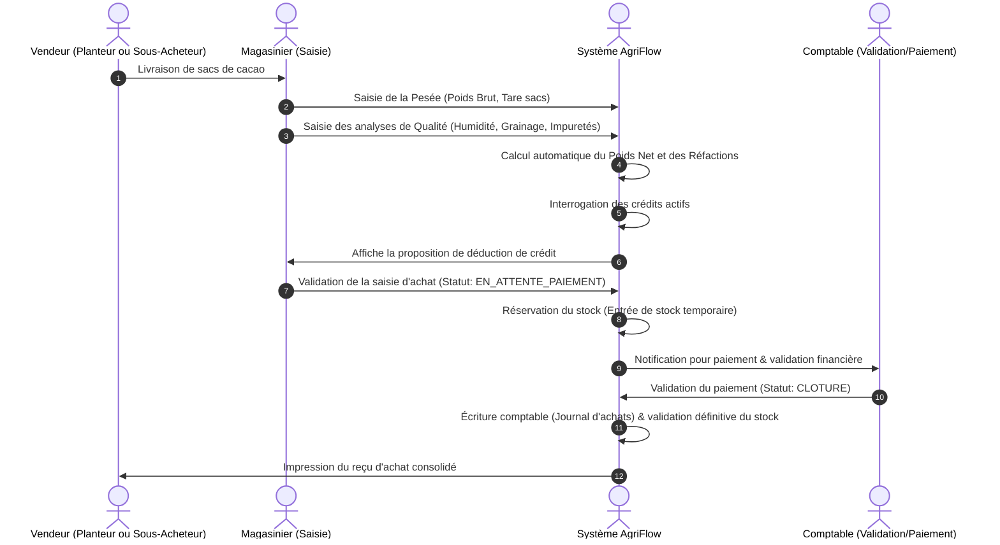

# Conception Technique et Fonctionnelle — Gestion des Achats de Cacao (Module 7)

Ce document présente l'architecture logicielle et les spécifications fonctionnelles détaillées pour implémenter le module de **Gestion des Achats de Cacao** au sein de l'ERP AgriFlow. Il est conçu pour être directement exploitable par l'équipe de développement.

---

## 1. Architecture Globale et Flux d'Achat

Le module Achat gère l'enregistrement physique et financier des fèves de cacao arrivant dans les magasins (locaux ou régionaux), calcule les réfactions (réductions de poids/prix selon l'humidité et les impuretés), déduit les avances de crédit en cours et génère les écritures de stock et comptables.



---

## 2. Modèle de Données (PostgreSQL / Prisma)

Pour intégrer le module dans le schéma existant d'AgriFlow, nous définissons les modèles suivants pour étendre `schema.prisma`.

```prisma
enum CocoaQualityGrade {
  GRADE_1    // Excellente qualité (Humidité <= 8%, Grainage <= 100, Déchets <= 1%)
  GRADE_2    // Qualité standard (Humidité <= 9%, Grainage <= 110, Déchets <= 2%)
  SOUS_GRADE // Hors-norme / Réfactions élevées
}

enum PurchaseStatus {
  DRAFT
  PENDING_PAYMENT // Pesée et qualité validées, en attente de caisse
  PAID            // Payé et clôturé
  CANCELLED
}

// Extension du modèle Purchase existant ou définition complète :
model Purchase {
  id                  String             @id @default(uuid()) @db.Uuid
  purchaseNumber      String             @unique @map("purchase_number") // Format: ACH-YYYYMM-XXXX
  status              PurchaseStatus     @default(PENDING_PAYMENT)
  
  // Acteurs impliqués
  planterId           String?            @db.Uuid @map("planter_id")
  planter             Planter?           @relation(fields: [planterId], references: [id])
  subBuyerId          String?            @db.Uuid @map("sub_buyer_id")
  subBuyer            User?              @relation("SubBuyerPurchases", fields: [subBuyerId], references: [id])
  
  buyerId             String             @db.Uuid @map("buyer_id")
  buyer               User               @relation("BuyerPurchases", fields: [buyerId], references: [id])
  storeId             String             @db.Uuid @map("store_id")
  store               Store              @relation(fields: [storeId], references: [id])

  // Informations sur le cacao
  campaign            String             // ex: "2025/2026"
  lotNumber           String?            @map("lot_number") // Numéro de lot traçabilité
  bagCount            Int                @map("bag_count")
  packagingType       String             @map("packaging_type") // JUTE, PLASTIQUE
  qualityGrade        CocoaQualityGrade  @default(GRADE_2) @map("quality_grade")

  // Pesée & Tare
  weightGross         Float              @map("weight_gross") // Poids brut total (kg)
  weightBags          Float              @map("weight_bags")  // Poids estimé des sacs (kg)
  weightNet           Float              @map("weight_net")   // weightGross - weightBags
  
  // Analyse Qualité (Réfactions)
  moistureRate        Float              @map("moisture_rate")  // Humidité %
  impurityRate        Float              @map("impurity_rate")  // Taux de déchets %
  moldyRate           Float              @map("moldy_rate")     // Fèves moisies %
  slatyRate           Float              @map("slaty_rate")     // Fèves ardoisées %
  insectRate          Float              @map("insect_rate")    // Fèves mitées/insects %
  grainage            Int                // Nombre de fèves par 100g
  
  weightRefactionKg   Float              @default(0.0) @map("weight_refaction_kg") // Poids déduit (kg)
  weightNetPaid       Float              @map("weight_net_paid") // weightNet - weightRefactionKg

  // Tarification
  pricePerKg          Float              @map("price_per_kg") // Prix au kg fixé pour la campagne
  amountGross         Float              @map("amount_gross") // weightNetPaid * pricePerKg
  
  // Déductions Financières
  creditDeduction     Float              @default(0.0) @map("credit_deduction") // Crédits retenus automatiquement
  amountNetPaid       Float              @map("amount_net_paid") // amountGross - creditDeduction

  // Métadonnées balance
  scaleModel          String?            @map("scale_model")
  scaleSerialNumber   String?            @map("scale_serial_number")

  createdAt           DateTime           @default(now()) @map("created_at")
  updatedAt           DateTime           @updatedAt @map("updated_at")

  // Relations
  deductions          AutoDeduction[]
  stockMovements      StockMovement[]

  @@index([purchaseNumber])
  @@map("purchases")
}
```

---

## 3. Algorithme de Calcul des Réfactions (Deductions Poids)

Les réfactions de poids sont calculées selon des barèmes standardisés en Afrique de l'Ouest (norme CCC / ARCC) :

1. **Réfraction Humidité (Seuil standard = 8%) :**
   - Si `moistureRate <= 8.0%` : Aucune réfaction.
   - Si `moistureRate > 8.0%` et `moistureRate <= 10.0%` : Réfraction proportionnelle.
     `RefactionHumiditéKg = weightNet * (moistureRate - 8) / 100`.
   - Si `moistureRate > 10.0%` : Pénalité doublée.
     `RefactionHumiditéKg = weightNet * ((moistureRate - 8) * 2) / 100`.

2. **Réfraction Impuretés / Déchets (Seuil standard = 1%) :**
   - Si `impurityRate <= 1.0%` : Aucune réfaction.
   - Si `impurityRate > 1.0%` :
     `RefactionImpuretésKg = weightNet * (impurityRate - 1) / 100`.

3. **Poids Net Payé :**
   `weightNetPaid = weightNet - (RefactionHumiditéKg + RefactionImpuretésKg)`.

4. **Montant Brut :**
   `amountGross = weightNetPaid * pricePerKg`.

---

## 5. Spécifications des API REST

### 1. Enregistrer un achat
* **URL :** `/api/v1/purchases`
* **Méthode :** `POST`
* **Request Body :**
  ```json
  {
    "planterId": "a7b05cc-8b43-41c6-9477-9ff4ad2a",
    "storeId": "c2b0c3f0-4592-42a9-bdf3-8ab34771",
    "campaign": "2025/2026",
    "bagCount": 15,
    "packagingType": "JUTE",
    "weightGross": 1050.0,
    "weightBags": 15.0,
    "moistureRate": 8.5,
    "impurityRate": 1.2,
    "moldyRate": 0.5,
    "slatyRate": 1.0,
    "insectRate": 0.0,
    "grainage": 98,
    "pricePerKg": 1500,
    "scaleModel": "Mettler Toledo Panther",
    "scaleSerialNumber": "MT-99210-A"
  }
  ```
* **Response JSON (201 Created) :**
  Contient tous les calculs de réfaction effectués par le serveur (`weightRefactionKg`, `weightNetPaid`, `amountGross`, `creditDeduction` proposé, etc.).

---

## 6. Mode Hors-Ligne (Offline-First)

Pour les achats effectués par les pisteurs ou acheteurs de brousse sans connexion Internet :
- **Formulaire de saisie locale :** Toutes les données de pesée et de qualité sont sauvegardées dans la base IndexedDB locale via `localforage`.
- **Génération d'un code temporaire :** Le reçu d'achat hors-ligne contient un identifiant unique temporaire local (ex: `LOCAL-ACH-12345`).
- **Synchronisation automatique :** Dès détection d'une connexion internet, les achats sont sérialisés et transmis au serveur par ordre chronologique d'enregistrement. Le serveur génère le numéro officiel `ACH-YYYYMM-XXXX` et renvoie la confirmation.
