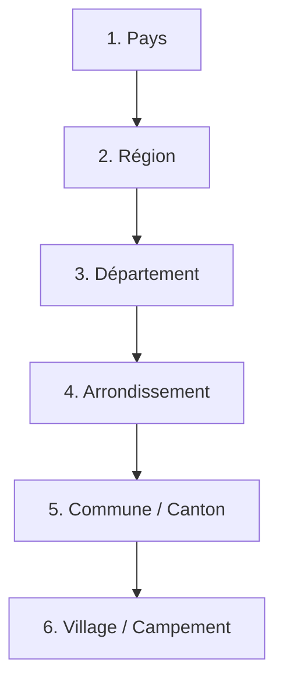

# AgriFlow — Dossier de Conception Technique et Fonctionnelle
## Module 5 : Gestion des Chefs de Zone

---

## 1. Objectif du Module

Le module **Gestion des Chefs de Zone** est un composant central de la gestion opérationnelle et logistique d'AgriFlow. Dans la filière café-cacao en Afrique, le Chef de Zone (Area Manager) est le pivot de l'encadrement terrain. Il fait le pont entre la direction générale (ou le service comptable basé au siège) et les sous-acheteurs (pisteurs) et planteurs répartis dans sa zone de compétence.

Ce module a pour objectifs de :
* **Structurer le réseau de collecte :** Modéliser précisément la hiérarchie géographique et administrative, du pays jusqu'au village.
* **Superviser l'équipe de terrain :** Rattacher des sous-acheteurs à chaque chef de zone et suivre leurs activités (avances de fonds, achats physiques, livraisons, performances).
* **Suivre et piloter les objectifs :** Fixer des objectifs précis par période et par zone (volumes de cacao achetés, qualité, planteurs actifs, recouvrement des crédits) et suivre leur réalisation en temps réel.
* **Optimiser la logistique et la qualité :** Surveiller les flux de cacao livrés aux magasins régionaux de sa zone, contrôler la qualité moyenne du cacao collecté (réfactions, humidité) et limiter les pertes de matières.
* **Encadrer le mode mobile hors-ligne :** Permettre aux chefs de zone d'utiliser l'application mobile en brousse pour enregistrer des visites chez les planteurs, géolocaliser des parcelles, prendre des photos de contrôle et synchroniser les données de retour en zone connectée.

---

## 2. Création et Fiche Profil du Chef de Zone

Le Chef de Zone est un utilisateur principal de la table `User` possédant le rôle `CHEF_DE_ZONE`. Ses attributs spécifiques sont gérés via le modèle lié `ZoneManagerProfile` (relation 1-to-1).

### Formulaire d'Enregistrement

Le formulaire de création comprend trois sections distinctes :

#### A. Informations Personnelles
* **Numéro automatique :** Identifiant unique généré par le système selon le format `CZ-YYYY-MM-XXXX` (ex: `CZ-2026-07-0012`).
* **Nom & Prénom :** Identité légale du chef de zone.
* **Sexe :** Homme (M) ou Femme (F).
* **Photo de profil :** Téléchargement d'un portrait au format JPG/PNG (redimensionné automatiquement en 512x512).
* **Téléphone principal :** Numéro de mobile (avec indicatif pays, ex: `+225` ou `+237`) utilisé pour l'authentification et les notifications.
* **Téléphone secondaire :** Numéro alternatif pour les cas d'urgence en zone de mauvaise couverture.
* **E-mail :** Adresse e-mail unique (requise pour l'accès à la plateforme web).
* **Adresse :** Lieu de résidence principal ou bureau local.

#### B. Informations Professionnelles
* **Date de recrutement :** Date d'embauche ou d'affectation au poste.
* **Région / Département / Arrondissement :** Découpage de référence où se situe son bureau principal.
* **Zones couvertes :** Liste multi-sélection des zones géographiques (communes, départements ou villages) placées sous sa responsabilité directe.
* **Magasin principal :** Magasin régional de rattachement (`Store`) où le cacao supervisé doit être principalement livré.
* **Supérieur hiérarchique :** Lien vers un autre utilisateur (`User`) de rôle `DIRECTEUR` ou administrateur.
* **Statut :** 
  * `ACTIVE` : Compte actif, habilité à superviser et affecter des zones.
  * `SUSPENDED` : Accès bloqué, les affectations sont gelées, mais l'historique est conservé.
  * `INACTIVE` : Fin de contrat ou départ, les zones gérées sont libérées pour réaffectation.

---

## 3. Gestion des Zones Géographiques

Pour s'adapter à la réalité du terrain et aux différents pays producteurs (Côte d'Ivoire, Cameroun, Ghana), le système implémente une structure arborescente et flexible via le modèle `GeographicZone`.

### Hiérarchie Géographique
La structure hiérarchique est la suivante (relations parent-enfant 1-to-N) :


### Règles d'Affectation
1. **Unicité :** Une zone géographique de niveau `VILLAGE` ou `COMMUNE` ne peut être affectée qu'à un **seul** chef de zone actif à la fois.
2. **Héritage :** Si un chef de zone est affecté à un `Département`, il hérite automatiquement de la supervision de tous les `Arrondissements`, `Communes` et `Villages` dépendants de ce département, sauf si une sous-zone spécifique a été attribuée à un autre chef de zone via une dérogation spéciale.
3. **Dérogation Spéciale (Autorisation Spéciale) :** Le système permet de cocher une option `specialPermission` lors de l'affectation pour autoriser le partage temporaire d'une zone de collecte à forte densité de production entre deux chefs de zone. L'historique des modifications d'affectation est consigné dans la table `ZoneAssignmentHistory`.

---

## 4. Gestion des Sous-acheteurs (Supervision)

Depuis la fiche détaillée d'un Chef de Zone sur la plateforme web ou tablette, un onglet dédié **« Sous-acheteurs Supervisés »** permet de gérer directement son équipe de pisteurs.

### Actions de Gestion
* **Rattachement / Affectation :** Liaison d'un sous-acheteur (`User` de rôle `SOUS_ACHETEUR`) au chef de zone. Cette action met à jour le champ `managerId` du sous-acheteur vers l'identifiant du chef de zone.
* **Mutation d'affectation :** Changement du chef de zone responsable. L'historique de mutation est enregistré pour conserver la cohérence des performances historiques du pisteur.
* **Suivi des Avances et Soldes :** Vue d'ensemble sur le solde de caisse de chaque pisteur (total des avances reçues du siège, montant des achats justifiés par des reçus de planteurs, montant des dépenses opérationnelles déclarées, et solde disponible restant).
* **Validation des Livraisons :** Suivi des camions expédiés par ses pisteurs vers le magasin régional et consultation des écarts de pesée.
* **Suspension temporaire :** En cas d'anomalie ou de dépassement suspect de solde non justifié, le chef de zone peut suspendre l'activité d'un sous-acheteur. Cette action empêche le pisteur d'enregistrer de nouveaux achats ou de recevoir de nouvelles avances sur son application mobile.

---

## 5. Tableau de Bord du Chef de Zone

Le tableau de bord du Chef de Zone synthétise en temps réel la situation opérationnelle, financière et logistique de son secteur.

### Indicateurs Clés de Performance (KPI)

| Indicateur | Mode de Calcul / Formule | Description |
| :--- | :--- | :--- |
| **Nombre de Sous-acheteurs** | `Count(Users WHERE managerId = CZ.Id AND role = 'SOUS_ACHETEUR')` | Taille de l'équipe active. |
| **Planteurs Suivis** | `Count(Planters WHERE zoneManagerId = CZ.Id OR subBuyerId IN (Sous-Acheteurs.Ids))` | Nombre de producteurs encadrés. |
| **Quantité Achetée (Aujourd'hui / Mois / Année)** | `Sum(Purchase.quantityKg WHERE date IN [Période] AND buyerId IN (Sous-Acheteurs.Ids))` | Volume total de cacao acheté physique. |
| **Valeur des Achats** | `Sum(Purchase.totalAmount WHERE buyerId IN (Sous-Acheteurs.Ids))` | Trésorerie distribuée aux planteurs. |
| **Crédits en Cours** | `Sum(Credit.amount WHERE status = 'PENDING' AND subBuyerId IN (Sous-Acheteurs.Ids))` | Financements octroyés non remboursés. |
| **Remboursements Reçus** | `Sum(Repayment.amount WHERE creditId IN (Crédits.Ids))` | Sommes collectées sur les crédits. |
| **Bénéfice Estimé** | `Sum(Volume * (Prix_Coop - Prix_Achat)) - Somme(Dépenses_Pisteurs)` | Marge opérationnelle brute de la zone. |
| **Taux de Perte Moyen** | `Average(SubBuyerDelivery.lossPercentage WHERE subBuyerProfileId IN (CZ.Pisteurs))` | Écart de pesée moyen (Champ vs Magasin). |
| **Taux de Réalisation** | `(Volume_Acheté / Objectif_Volume) * 100` | Atteinte de l'objectif sur la période. |

---

## 6. Objectifs Opérationnels

Le siège social peut affecter des objectifs quantitatifs et qualitatifs aux Chefs de Zone, qui sont ensuite déclinés par sous-acheteur.

### Paramétrage des Objectifs
* **Périodicité :** Journalière, Hebdomadaire, Mensuelle, Annuelle (Campagne).
* **Indicateurs Cibles :**
  * Volume d'achat cible (en kg ou en tonnes de cacao).
  * Valeur maximale d'achat (pour contrôler le budget d'avances).
  * Nombre de planteurs actifs (ayant effectué au moins une vente sur la période).
  * Recrutement de nouveaux planteurs (intégration dans la base KYC d'AgriFlow).
  * Taux de recouvrement des crédits octroyés en début de campagne (en %).
* **Visualisation :** Jauges circulaires de progression et graphiques à barres comparant l'objectif cible et le réalisé actuel.

---

## 7. Performance et Classement (Leaderboard)

Le système génère un classement automatique des chefs de zone pour stimuler la productivité et identifier les zones les plus performantes de la coopérative.

### Score de Performance Globale (SPG)
Le classement est basé sur un algorithme pondéré attribuant une note sur 100 :
$$\text{SPG} = (W_v \times S_{volume}) + (W_q \times S_{qualite}) + (W_r \times S_{recouvrement}) - (W_p \times S_{pertes})$$

* **Pondérations par défaut :** 
  * Volume de cacao ($W_v$) : **40%**
  * Qualité / Réfactions minimales ($W_q$) : **30%** (calculé sur le taux moyen d'humidité < 8% et taux de déchets < 2%)
  * Taux de recouvrement des crédits ($W_r$) : **20%**
  * Taux de perte logistique ($W_p$) : **10%** (pénalité proportionnelle aux écarts de poids sur les livraisons)

### Restitution Visuelle
* **Tableau de Performance :** Liste interactive triable avec filtres par période (campagne principale, campagne intermédiaire).
* **Graphique Radar :** Comparaison de la performance d'un chef de zone par rapport à la moyenne générale de la coopérative sur 5 axes (Volume, Qualité, Fidélité planteurs, Recouvrement, Rigueur comptable).

---

## 8. Cartographie Interactive (Visualisation SIG)

L'interface cartographique utilise des fonds de carte OpenStreetMap (via Leaflet ou Mapbox GL JS) avec un stockage local des tuiles pour les versions tablettes.

### Éléments Affichés sur la Carte
* **Polygones des Zones :** Délimitation des départements et arrondissements (couleurs variant selon le volume de collecte sur la période : Vert = Fort, Jaune = Moyen, Rouge = Faible).
* **Marqueurs Magasins (Icône Silo) :** Localisation des magasins régionaux (`Store`), avec infobulle affichant la capacité actuelle de stockage et les alertes de saturation.
* **Marqueurs Sous-acheteurs (Icône Camion/Pisteur) :** Dernière position GPS synchronisée des pisteurs, indiquant leur volume collecté cumulé sur la journée.
* **Marqueurs Planteurs / Plantations (Icône Arbre) :** Localisation géographique des parcelles. La couleur de l'arbre indique le statut KYC du planteur (Vert = Validé, Orange = En attente de document, Rouge = Suspendu).
* **Filtres Avancés :** Filtrer par Chef de Zone, par volume de production, ou par type de cacao (certifié UTZ/Rainforest, conventionnel).

---

## 9. Système d'Alertes et Notifications

Le module intègre un moteur de règles asynchrone qui analyse les données toutes les heures pour lever des alertes ciblées :

* **Alerte Inactivité :** Déclenchée si un sous-acheteur rattaché à la zone n'enregistre aucune transaction d'achat ou de livraison pendant plus de **5 jours consécutifs** en pleine campagne de récolte.
* **Alerte Chute de Volume :** Déclenchée si le volume hebdomadaire collecté dans une zone géographique chute de plus de **40%** par rapport à la moyenne des 3 semaines précédentes.
* **Alerte Écart de Stock Critique :** Déclenchée dès qu'un écart supérieur à **1,5%** est validé entre les quantités déclarées par un sous-acheteur lors du chargement et le poids réel pesé par le magasinier à la réception du camion.
* **Alerte Crédit en Retard :** Déclenchée 7 jours avant la date d'échéance d'un crédit important (> 500 000 FCFA), et tous les jours après l'échéance si le solde reste impayé.
* **Alerte Objectif en Danger :** Déclenchée à la moitié de la période (ex: au 15 du mois) si le taux d'atteinte de l'objectif de volume est inférieur à **35%**.

---

## 10. Matrice des Permissions (RBAC)

Pour sécuriser les opérations et la gestion géographique, la matrice suivante définit précisément les droits d'accès :

| Rôle | Profil CZ (Créer/Edit) | Affecter Zones | Définir Objectifs | Voir Dashboard CZ | Valider Visites | Gérer Pisteurs |
| :--- | :---: | :---: | :---: | :---: | :---: | :---: |
| **Administrateur** | **Oui** | **Oui** | **Oui** | **Oui** | **Oui** | **Oui** |
| **Directeur** | **Oui** | **Oui** | **Oui** | **Oui** | **Oui** | **Oui** |
| **Chef de Zone** | Non (Lecture) | Non | Non | **Oui** (Sa zone) | **Oui** (Ses pisteurs) | **Oui** (Lecture) |
| **Comptable** | Non | Non | Non | **Oui** (Lecture) | Non | Non |
| **Magasinier** | Non | Non | Non | Non | Non | Non |
| **Auditeur** | Non | Non | Non | **Oui** (Lecture) | Non | Non |

---

## 11. Modélisation de la Base de Données

Les modèles suivants doivent être ajoutés ou mis à jour dans le fichier [schema.prisma](file:///c:/DEV/AgriFlow/backend/prisma/schema.prisma) de l'application NestJS.

```prisma
// ==========================================
// 1. Extension du Profil Utilisateur pour Chef de Zone
// ==========================================
model ZoneManagerProfile {
  id                    String            @id @default(uuid()) @db.Uuid
  userId                String            @unique @db.Uuid @map("user_id")
  user                  User              @relation(fields: [userId], references: [id], onDelete: Cascade)
  
  gender                String            @default("M") @db.VarChar(1) // M, F
  photoUrl              String?           @map("photo_url")
  phoneSecondary        String?           @map("phone_secondary")
  recruitmentDate       DateTime          @map("recruitment_date") @db.Date
  status                String            @default("ACTIVE") // ACTIVE, SUSPENDED, INACTIVE
  
  // Relations
  zones                 GeographicZone[]
  assignments           ZoneAssignment[]
  objectives            ZoneObjective[]
  planterVisits         PlanterVisit[]
  
  createdAt             DateTime          @default(now()) @map("created_at")
  updatedAt             DateTime          @updatedAt @map("updated_at")

  @@map("zone_manager_profiles")
}

// ==========================================
// 2. Modèle de Hiérarchie Géographique
// ==========================================
model GeographicZone {
  id                    String            @id @default(uuid()) @db.Uuid
  name                  String
  level                 String            // COUNTRY, REGION, DEPARTMENT, DISTRICT, COMMUNE, VILLAGE
  code                  String            @unique // Code unique ex: CIV-SUD-ABO-001
  
  // Auto-relation parent/enfant
  parentId              String?           @db.Uuid @map("parent_id")
  parent                GeographicZone?   @relation("ZoneHierarchy", fields: [parentId], references: [id], onDelete: Restrict)
  children              GeographicZone[]  @relation("ZoneHierarchy")
  
  // Chef de zone actuellement responsable
  currentManagerId      String?           @db.Uuid @map("current_manager_id")
  currentManager        ZoneManagerProfile? @relation(fields: [currentManagerId], references: [id], onDelete: SetNull)
  
  // Relations
  assignments           ZoneAssignment[]
  planterVisits         PlanterVisit[]
  
  createdAt             DateTime          @default(now()) @map("created_at")
  updatedAt             DateTime          @updatedAt @map("updated_at")

  @@index([level])
  @@map("geographic_zones")
}

// ==========================================
// 3. Historique d'Affectation des Zones
// ==========================================
model ZoneAssignment {
  id                    String            @id @default(uuid()) @db.Uuid
  zoneId                String            @db.Uuid @map("zone_id")
  zone                  GeographicZone    @relation(fields: [zoneId], references: [id], onDelete: Cascade)
  
  managerId             String            @db.Uuid @map("manager_id")
  manager               ZoneManagerProfile @relation(fields: [managerId], references: [id], onDelete: Cascade)
  
  assignedAt            DateTime          @default(now()) @map("assigned_at")
  revokedAt             DateTime?         @map("revoked_at")
  isActive              Boolean           @default(true) @map("is_active")
  specialPermission     Boolean           @default(false) @map("special_permission") // Autorisation spéciale de chevauchement
  notes                 String?           @db.Text
  
  @@map("zone_assignments")
}

// ==========================================
// 4. Objectifs de Cibles Opérationnelles
// ==========================================
model ZoneObjective {
  id                    String            @id @default(uuid()) @db.Uuid
  managerId             String            @db.Uuid @map("manager_id")
  manager               ZoneManagerProfile @relation(fields: [managerId], references: [id], onDelete: Cascade)
  
  period                String            // DAILY, WEEKLY, MONTHLY, ANNUAL
  startDate             DateTime          @map("start_date") @db.Date
  endDate               DateTime          @map("end_date") @db.Date
  
  // Cibles
  targetQuantityKg      Float             @map("target_quantity_kg")
  targetValueFCFA       Float             @map("target_value_fcfa")
  targetActivePlanters  Int               @map("target_active_planters")
  targetNewPlanters     Int               @map("target_new_planters")
  targetRepaymentFCFA   Float             @map("target_repayment_fcfa")
  
  // Réalisés
  achievedQuantityKg    Float             @default(0.0) @map("achieved_quantity_kg")
  achievedValueFCFA     Float             @default(0.0) @map("achieved_value_fcfa")
  achievedActivePlanters Int              @default(0) @map("achieved_active_planters")
  achievedNewPlanters   Int               @default(0) @map("achieved_new_planters")
  achievedRepaymentFCFA Float             @default(0.0) @map("achieved_repayment_fcfa")
  
  createdAt             DateTime          @default(now()) @map("created_at")
  updatedAt             DateTime          @updatedAt @map("updated_at")

  @@map("zone_objectives")
}

// ==========================================
// 5. Suivi des Visites Terrain / Mobile
// ==========================================
model PlanterVisit {
  id                    String            @id @default(uuid()) @db.Uuid
  managerId             String            @db.Uuid @map("manager_id")
  manager               ZoneManagerProfile @relation(fields: [managerId], references: [id], onDelete: Cascade)
  
  planterId             String            @db.Uuid @map("planter_id")
  planter               Planter           @relation(fields: [planterId], references: [id], onDelete: Cascade)
  
  zoneId                String?           @db.Uuid @map("zone_id")
  zone                  GeographicZone?   @relation(fields: [zoneId], references: [id], onDelete: SetNull)
  
  visitDate             DateTime          @map("visit_date")
  purpose               String            // AGRONOMIC_CONTROL, CREDIT_EVALUATION, CROP_ESTIMATION, KYC_UPDATE
  comments              String            @db.Text
  
  // Géolocalisation de la plantation visitée
  latitude              Float?
  longitude             Float?
  
  // Preuves photos
  photoUrls             String[]          @map("photo_urls") // URLs des photos dans le Cloud (ex: S3/Supabase)
  
  // Offline Sync metadata
  localId               String?           @unique @map("local_id") // ID généré par l'app mobile hors-ligne
  isSynced              Boolean           @default(true) @map("is_synced")
  
  createdAt             DateTime          @default(now()) @map("created_at")
  updatedAt             DateTime          @updatedAt @map("updated_at")

  @@map("planter_visits")
}
```

---

## 12. Spécifications des APIs REST

Les contrôleurs NestJS implémentent les routes suivantes sécurisées par JWT et un garde de rôles.

### 1. Créer un profil de Chef de Zone
* **URL :** `/api/zone-managers`
* **Méthode :** `POST`
* **Accès :** `ADMIN`, `DIRECTEUR`
* **Validation (DTO) :**
  ```typescript
  class CreateZoneManagerDto {
    userId: string; // UUID de l'utilisateur existant
    gender: 'M' | 'F';
    photoUrl?: string;
    phoneSecondary?: string;
    recruitmentDate: string; // ISO date string
  }
  ```
* **Réponse JSON (201 Created) :**
  ```json
  {
    "id": "e30129bc-4389-4a0b-9dfc-2b28c89498ab",
    "userId": "d71891b0-13f5-449e-b91c-297f6c879203",
    "status": "ACTIVE",
    "recruitmentDate": "2026-07-01T00:00:00.000Z"
  }
  ```

### 2. Affecter une Zone Géographique
* **URL :** `/api/zone-managers/:id/zones`
* **Méthode :** `POST`
* **Accès :** `ADMIN`, `DIRECTEUR`
* **Paramètres DTO :**
  ```typescript
  class AssignZoneDto {
    zoneId: string;
    specialPermission?: boolean; // par defaut false
    notes?: string;
  }
  ```
* **Validation Métier :** Vérifie si la zone n'est pas déjà affectée à un autre chef de zone actif. Si oui, renvoie une erreur `409 Conflict` à moins que `specialPermission` soit défini sur `true`.
* **Réponse JSON (200 OK) :**
  ```json
  {
    "message": "Zone affectee avec succes.",
    "assignmentId": "a189f38c-c901-447b-891d-28e83b02cc82"
  }
  ```

### 3. Rattacher un sous-acheteur
* **URL :** `/api/zone-managers/:id/sub-buyers`
* **Méthode :** `POST`
* **Accès :** `ADMIN`, `DIRECTEUR`
* **Body :** `{ "subBuyerId": "UUID" }`
* **Action :** Met à jour la colonne `managerId` du sous-acheteur cible.
* **Réponse JSON (200 OK) :**
  ```json
  {
    "message": "Sous-acheteur rattache avec succes.",
    "managerId": "e30129bc-4389-4a0b-9dfc-2b28c89498ab"
  }
  ```

### 4. Consulter les Performances Globale (Classement)
* **URL :** `/api/zone-managers/performance/leaderboard`
* **Méthode :** `GET`
* **Accès :** `ADMIN`, `DIRECTEUR`, `COMPTABLE`, `CHEF_DE_ZONE`, `AUDITEUR`
* **Query Params :**
  * `startDate` (optionnel) : Date de début (ISO)
  * `endDate` (optionnel) : Date de fin (ISO)
* **Réponse JSON (200 OK) :**
  ```json
  [
    {
      "rank": 1,
      "managerId": "e30129bc-4389-4a0b-9dfc-2b28c89498ab",
      "fullName": "Jean Marcel Essono",
      "performanceScore": 92.5,
      "metrics": {
        "totalQuantityKg": 145000.0,
        "averageMoisture": 7.2,
        "repaymentRate": 95.0,
        "lossPercentage": 0.8
      }
    }
  ]
  ```

---

## 13. Interface Utilisateur (UI/UX)

L'interface web est développée en React/Vite et stylisée de manière moderne, épurée et réactive avec Tailwind CSS.

### Écrans Clés

#### 1. Fiche Profil du Chef de Zone
* **Disposition :** Structure en 3 volets (Sidebar de profil rapide, Corps principal avec onglets, Panneau droit d'actions rapides).
* **Onglets de la Fiche :**
  * **Tableau de Bord :** Graphiques à barres Recharts montrant l'évolution des achats hebdomadaires, jauge circulaire pour le taux de réalisation de l'objectif mensuel.
  * **Équipe Terrain (Pisteurs) :** Tableau interactif affichant le statut de chaque sous-acheteur supervisé, son solde de caisse en couleur (Vert = Correct, Orange = Limite de crédit atteinte, Rouge = Dépassement). Bouton « Mutique / Rallier » en un clic.
  * **Découpage Géographique :** Liste des villages et cantons sous sa responsabilité avec boutons d'ajout et de retrait rapide.
  * **Visites Récentes :** Flux temporel (timeline) des visites de planteurs enregistrées par le chef de zone, avec accès aux photos et aux commentaires géolocalisés.

#### 2. Carte Interactive SIG
* **Visualisation :** Intégration de Leaflet pour afficher une carte plein écran.
* **Légende et Couleurs :** Code couleur dynamique sur les grappes de planteurs (Clusters) selon la quantité estimée de récoltes.
* **Filtres Flottants :** Menu rétractable à gauche pour filtrer instantanément par zone administrative ou par sous-acheteur.

---

## 14. Mode Mobile & Fonctionnalités Hors-ligne

Le module mobile est une section dédiée aux chefs de zone dans l'application mobile AgriFlow (PWA / React Native).

### Gestion de la Déconnexion (Offline-First)
* **Stockage Local :** Utilisation de SQLite avec l'ORM WatermelonDB pour stocker la structure géographique, la base des planteurs de la zone et les fiches visites en cache local.
* **Enregistrement des Visites :** Lorsque le chef de zone est dans un campement sans réseau (zone blanche) :
  1. Il remplit le formulaire de visite.
  2. L'application capture la géolocalisation via la puce GPS du smartphone (enregistrée sous forme de coordonnées décimales).
  3. L'application stocke les photos prises localement dans le répertoire de cache temporaire de l'appareil.
  4. La visite est enregistrée en base locale avec le drapeau `isSynced = false` et un identifiant UUID local unique (`localId = "LOC-xxxx"`).
* **Algorithme de Synchronisation :**
  * Dès que l'appareil détecte une connexion stable (3G/4G ou Wi-Fi) :
    1. L'application charge en tâche de fond les fichiers photos vers le serveur de stockage cloud (Supabase Storage) et récupère les URLs cloud publiques.
    2. Elle envoie ensuite les données JSON de la visite (incluant les URLs cloud des photos) vers le point de terminaison `/api/planter-visits/sync`.
    3. Le serveur de base de données insère la visite, effectue les jointures et renvoie un accusé de réception `200 OK`.
    4. L'application mobile remplace le statut de la visite locale à `isSynced = true`.

---

## 15. Plan de Tests de Validation

Pour garantir un niveau de qualité de production, les cas suivants doivent être validés automatiquement et manuellement.

### A. Tests Fonctionnels
* **Vérification d'Unicité :** Écrire un test unitaire garantissant qu'une tentative d'affecter le village *Campement A* à un deuxième chef de zone actif renvoie une erreur `409` si le premier est toujours actif, et fonctionne si le premier est archivé.
* **Intégrité de la Cascade :** S'assurer que la suppression d'un profil de chef de zone ne supprime pas les visites de planteurs enregistrées mais les réaffecte à la valeur `SetNull` pour conserver l'historique d'audit.

### B. Tests de Sécurité
* **Vérification RBAC :** Injecter un token JWT d'un utilisateur de rôle `COMPTABLE` sur la route de création de chef de zone `/api/zone-managers` et s'assurer que l'API renvoie un code d'erreur `403 Forbidden`.
* **Validation de Payload :** Injecter des coordonnées GPS invalides (ex: latitude = 120.0) sur la route de création de visite et valider la levée automatique d'une exception `400 Bad Request` via `ValidationPipe`.

### C. Tests de Performance
* **Chargement de la Carte :** Simuler l'affichage de **5 000 marqueurs de planteurs** simultanés sur la carte et s'assurer que le temps de rendu et la réactivité du zoom restent inférieurs à **200 ms** grâce au regroupement de marqueurs (*Marker Clustering*).
* **Requêtes de Leaderboard :** Indexer la table `purchases` sur les colonnes `buyerId` et `date` pour garantir que le calcul du score de performance en pleine saison (base de plus de 100 000 transactions d'achats) s'exécute en moins de **300 ms**.
