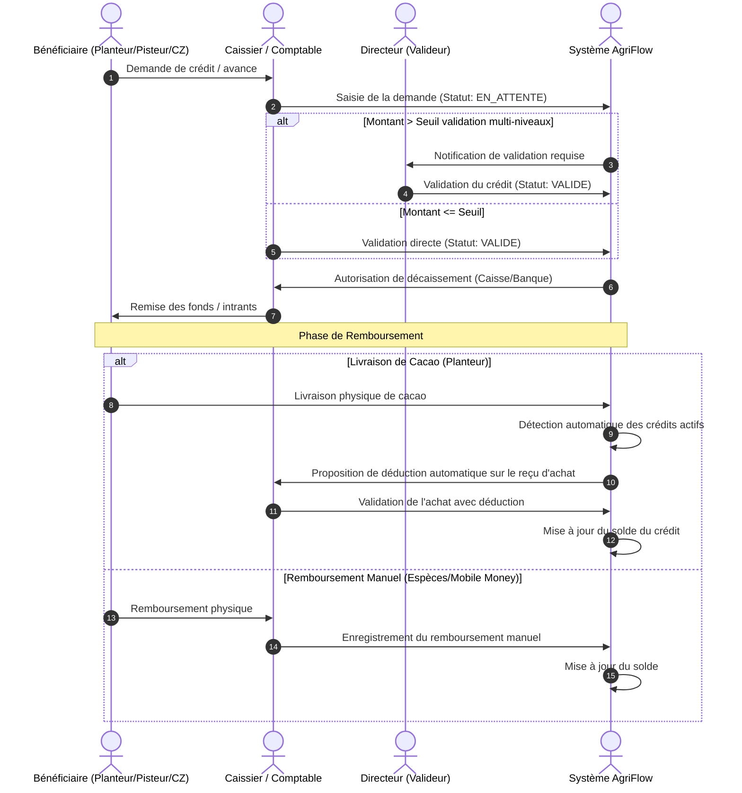

# Conception Technique et Fonctionnelle — Gestion des Crédits et des Avances (Module 6)

Ce document présente l'architecture logicielle et les spécifications fonctionnelles détaillées pour implémenter le module de **Gestion des Crédits et des Avances** au sein de l'ERP AgriFlow. Il est conçu pour être directement exploitable par l'équipe de développement.

---

## 1. Architecture Globale et Flux de Crédit

Le module gère le cycle de vie complet des crédits accordés aux trois acteurs clés (Planteurs, Sous-Acheteurs, Chefs de Zone) et automatise leur recouvrement lors des transactions commerciales (achat de cacao ou justification de fonds).



---

## 2. Modèle de Données (PostgreSQL / Prisma)

Pour intégrer le module dans la base de données existante d'AgriFlow, nous définissons les modèles suivants à ajouter au fichier `schema.prisma`.

```prisma
enum CreditType {
  PLANTER_CAMPAGNE       // Avance de campagne planteur
  PLANTER_INPUTS         // Achat d'intrants (engrais, matériel)
  PLANTER_PERSONAL       // Prêt personnel planteur
  PLANTER_TRANSPORT      // Avance sur transport planteur
  PLANTER_EMERGENCY      // Urgence familiale planteur
  SUB_BUYER_FUNDS        // Fonds d'achat sous-acheteur
  SUB_BUYER_FUEL         // Carburant sous-acheteur
  SUB_BUYER_TRANSPORT    // Transport sous-acheteur
  SUB_BUYER_MISSION      // Frais de mission sous-acheteur
  ZONE_MANAGER_OPS       // Fonctionnement chef de zone
  ZONE_MANAGER_TRAVEL    // Déplacement chef de zone
  ZONE_MANAGER_RECRUIT   // Recrutement planteurs chef de zone
}

enum BeneficiaryType {
  PLANTER
  SUB_BUYER
  ZONE_MANAGER
}

enum CreditStatus {
  DRAFT
  PENDING_VALIDATION
  APPROVED
  ACTIVE                 // Fonds décaissés, en cours de remboursement
  REPAID                 // Entièrement remboursé
  OVERDUE                // En retard de paiement
  CANCELLED
  WRITTEN_OFF            // Créance douteuse / passée en perte
}

enum PaymentMethod {
  CASH
  BANK_TRANSFER
  MOBILE_MONEY
  INPUTS_IN_KIND         // Remise physique d'intrants
}

model CreditCategory {
  id          String       @id @default(uuid()) @db.Uuid
  code        String       @unique // ex: PLANTER_INPUTS
  label       String       // Libellé en français (ex: "Achat d'intrants")
  description String?
  isActive    Boolean      @default(true) @map("is_active")
  credits     Credit[]

  @@map("credit_categories")
}

model Credit {
  id                  String             @id @default(uuid()) @db.Uuid
  creditNumber        String             @unique @map("credit_number") // Format: CR-YYYYMM-XXXX
  beneficiaryType     BeneficiaryType    @map("beneficiary_type")
  beneficiaryId       String             @db.Uuid @map("beneficiary_id") // ID de Planter, SubBuyerProfile, ou ZoneManagerProfile
  categoryId          String             @db.Uuid @map("category_id")
  category            CreditCategory     @relation(fields: [categoryId], references: [id])
  
  amountGranted       Decimal            @db.Decimal(15, 2) @map("amount_granted")
  amountRepaid        Decimal            @default(0) @db.Decimal(15, 2) @map("amount_repaid")
  balance             Decimal            @db.Decimal(15, 2) // amountGranted - amountRepaid (calculé automatiquement ou mis à jour par transaction)
  currency            String             @default("XOF") @db.VarChar(3)
  
  grantedAt           DateTime           @map("granted_at") @db.Date
  dueDate             DateTime           @map("due_date") @db.Date
  paymentMethod       PaymentMethod      @map("payment_method")
  sourceAccount       String             @map("source_account") // Nom de la caisse ou banque d'origine
  
  status              CreditStatus       @default(DRAFT)
  observations        String?            @db.Text
  attachments         String[]           @map("attachments") // URLs des fichiers joints (contrat, reçu)
  
  // Tracabilité & Validations
  createdById         String             @db.Uuid @map("created_by_id")
  createdBy           User               @relation("CreditCreator", fields: [createdById], references: [id])
  validatedById       String?            @db.Uuid @map("validated_by_id")
  validatedBy         User?              @relation("CreditValidator", fields: [validatedById], references: [id])
  validatedAt         DateTime?          @map("validated_at")
  
  // Relations
  repayments          Repayment[]
  deductions          AutoDeduction[]
  logs                CreditAuditLog[]

  createdAt           DateTime           @default(now()) @map("created_at")
  updatedAt           DateTime           @updatedAt @map("updated_at")

  @@index([beneficiaryId, beneficiaryType])
  @@index([status])
  @@map("credits")
}

model Repayment {
  id            String        @id @default(uuid()) @db.Uuid
  creditId      String        @db.Uuid @map("credit_id")
  credit        Credit        @relation(fields: [creditId], references: [id], onDelete: Restrict)
  amount        Decimal       @db.Decimal(15, 2)
  repaidAt      DateTime      @map("repaid_at")
  paymentMethod PaymentMethod @map("payment_method")
  receivedById  String        @db.Uuid @map("received_by_id")
  receivedBy    User          @relation(fields: [receivedById], references: [id])
  observations  String?       @db.Text
  isAuto        Boolean       @default(false) @map("is_auto") // Vrai si prélevé automatiquement sur un achat

  createdAt     DateTime      @default(now()) @map("created_at")

  @@map("repayments")
}

model AutoDeduction {
  id              String    @id @default(uuid()) @db.Uuid
  creditId        String    @db.Uuid @map("credit_id")
  credit          Credit    @relation(fields: [creditId], references: [id])
  deliveryId      String?   @db.Uuid @map("delivery_id") // ID de la livraison de cacao (si planteur)
  justificationId String?   @db.Uuid @map("justification_id") // ID de la justification d'avance (si pisteur)
  amountDeducted  Decimal   @db.Decimal(15, 2) @map("amount_deducted")
  deductedAt      DateTime  @default(now()) @map("deducted_at")

  @@map("auto_deductions")
}

model CreditLimit {
  id              String          @id @default(uuid()) @db.Uuid
  beneficiaryType BeneficiaryType @map("beneficiary_type")
  beneficiaryId   String          @unique @db.Uuid @map("beneficiary_id")
  maxLimit        Decimal         @db.Decimal(15, 2) @map("max_limit")
  updatedById     String          @db.Uuid @map("updated_by_id")
  updatedBy       User            @relation(fields: [updatedById], references: [id])
  updatedAt       DateTime        @updatedAt @map("updated_at")

  @@map("credit_limits")
}

model CreditAuditLog {
  id          String   @id @default(uuid()) @db.Uuid
  creditId    String   @db.Uuid @map("credit_id")
  credit      Credit   @relation(fields: [creditId], references: [id], onDelete: Cascade)
  userId      String   @db.Uuid @map("user_id")
  user        User     @relation(fields: [userId], references: [id])
  action      String   // CREATE, UPDATE, VALIDATE, REPAY, CANCEL, WRITE_OFF
  payloadBefore Json?    @map("payload_before")
  payloadAfter  Json?    @map("payload_after")
  timestamp   DateTime @default(now()) @map("timestamp")

  @@map("credit_audit_logs")
}
```

---

## 3. Spécifications des Règles Métier (Business Rules)

### A. Calcul automatique des soldes et statut
* **Calcul :** À chaque enregistrement de `Repayment` ou `AutoDeduction`, le système recalcule le solde restant : `balance = amountGranted - (Somme des remboursements + Somme des déductions)`.
* **Mise à jour statut :**
  - Si `balance <= 0`, le statut passe à `REPAID`.
  - Si `dueDate < CURRENT_DATE` et `balance > 0`, le statut passe à `OVERDUE`.

### B. Algorithme de Déduction Automatique sur Achat
Lorsqu'un Sous-Acheteur saisit un reçu d'achat de cacao pour un Planteur `P` :
1. Le système interroge les crédits de `P` avec le statut `ACTIVE` ou `OVERDUE`.
2. S'il en trouve, il calcule le montant total d'achat brut `AchatBrut = Quantité * PrixFixé`.
3. Le système propose une déduction automatique selon la règle configurable (par défaut: **maximum 50% du montant brut** de l'achat pour laisser un revenu minimal au planteur) :
   `MontantProposé = Min(SoldeRestantDuCrédit, AchatBrut * 0.5)`.
4. L'utilisateur peut modifier ce montant s'il a les permissions appropriées, mais ne peut pas dépasser 100% de l'achat brut.

### C. Gestion des Plafonds (CreditLimit)
* Lors de la saisie d'un nouveau crédit, le système vérifie :
  `Somme des soldes des crédits actifs de l'acteur + NouveauMontant > LimiteMaxConfigurée`.
* Si la limite est dépassée :
  - **Bloquer la soumission** pour les rôles standard (Chef de Zone, Caissier).
  - **Demander une clé de validation/dérogation** (saisie d'un mot de passe ou validation par notification) d'un Directeur ou Administrateur.

---

## 4. Matrice des Droits et Permissions

Le tableau suivant récapitule les droits d'accès sur le module Crédits & Avances :

| Rôle | Créer un crédit | Modifier brouillon | Valider un crédit | Annuler un crédit | Remboursement (Manuel) | Consulter / Rapports |
| :--- | :---: | :---: | :---: | :---: | :---: | :---: |
| **Administrateur** | ✅ | ✅ | ✅ | ✅ | ✅ | ✅ |
| **Directeur** | ✅ | ✅ | ✅ | ✅ | ✅ | ✅ |
| **Comptable** | ✅ | ✅ | ❌ | ✅ | ✅ | ✅ |
| **Caissier** | ✅ | ✅ (uniquement) | ❌ | ❌ | ✅ | ❌ (lecture seule liste) |
| **Chef de zone** | ✅ (brouillon) | ✅ (brouillon) | ❌ | ❌ | ❌ | ⚠️ (uniquement ses CZ) |
| **Magasinier** | ❌ | ❌ | ❌ | ❌ | ❌ | ❌ |
| **Auditeur** | ❌ | ❌ | ❌ | ❌ | ❌ | ✅ (lecture seule globale) |

---

## 5. Spécifications des API REST

### 1. Créer un crédit
* **URL :** `/api/v1/credits`
* **Méthode :** `POST`
* **Headers :** `Authorization: Bearer <token>`
* **Request Body :**
  ```json
  {
    "beneficiaryType": "PLANTER",
    "beneficiaryId": "4a7b05cc-8b43-41c6-9477-9ff4ad2a259c",
    "categoryId": "c2b0c3f0-4592-42a9-bdf3-8ab34771c500",
    "amountGranted": 150000.00,
    "grantedAt": "2026-07-11",
    "dueDate": "2026-10-11",
    "paymentMethod": "CASH",
    "sourceAccount": "Caisse Centrale Abengourou",
    "observations": "Avance de campagne pour achat d'engrais"
  }
  ```
* **Validation :**
  - `amountGranted` doit être strictement positif.
  - `dueDate` doit être postérieure à `grantedAt`.
  - `beneficiaryId` doit exister dans la table correspondante.
* **Codes d'erreur :**
  - `400 Bad Request` : Erreur de validation des données ou dépassement du plafond sans dérogation.
  - `401 Unauthorized` : Authentification requise.
  - `403 Forbidden` : Rôle insuffisant.

### 2. Enregistrer un remboursement
* **URL :** `/api/v1/credits/:id/repayments`
* **Méthode :** `POST`
* **Request Body :**
  ```json
  {
    "amount": 50000.00,
    "repaidAt": "2026-08-01T10:30:00Z",
    "paymentMethod": "MOBILE_MONEY",
    "observations": "Remboursement partiel par Wave"
  }
  ```
* **Response JSON (201 Created) :**
  ```json
  {
    "id": "repay-88c2-45e0-94d3-1a22b79a",
    "creditId": "c2b0c3f0-...",
    "amount": 50000.00,
    "newBalance": 100000.00,
    "status": "ACTIVE"
  }
  ```

---

## 6. Spécifications de l'Interface Utilisateur (UI/UX)

L'interface doit être entièrement adaptative (Mobile-First car les caissiers et chefs de zone utilisent des tablettes/smartphones sur le terrain).

### A. Liste des Crédits
* **Filtres de recherche :** Par bénéficiaire (autocomplétion), par statut (Actif, Retard, Soldé), par catégorie, par plage de date d'octroi.
* **Badges de statut dynamiques :**
  - Vert pour `REPAID` (Soldé).
  - Rouge clignotant / vif pour `OVERDUE` (En retard).
  - Jaune pour `ACTIVE` (En cours).

### B. Composants de Tableau de Bord (Dashboard Crédits)
* **Cartes KPI en haut :**
  - **Montant Total En cours** (Somme des soldes restants).
  - **Taux de Recouvrement** (`(Total Remboursé / Total Accordé) * 100`).
  - **Montant des Impayés / Retards** (Somme des soldes des crédits `OVERDUE`).
* **Graphique 1 (Donut) :** Répartition des crédits par catégorie.
* **Graphique 2 (Barres empilées) :** Historique mensuel Décaissements vs Remboursements.

---

## 7. Fonctionnement Hors-Ligne (Offline-First)

Pour les agents terrain (Chefs de Zone en brousse) :
1. **Stockage Local :** L'application utilise `localforage` (IndexedDB) pour stocker localement les demandes de crédit en brouillon et les remboursements collectés hors connexion.
2. **Synchronisation :**
   - Dès que le réseau est détecté via `navigator.onLine`, une file d'attente synchronise en tâche de fond les requêtes POST stockées.
   - En cas de conflit (ex: crédit déjà soldé sur le serveur pendant la déconnexion), la transaction est marquée "En conflit" dans un centre de notification local pour arbitrage manuel par l'agent.

---

## 8. Sécurité et Contrôle d'Audit

* **Règle de validation à double niveau :** Tout crédit supérieur à **5 000 000 XOF** nécessite obligatoirement l'approbation d'un `DIRECTEUR` avant décaissement. Le caissier ne peut pas décaisser un tel montant de la caisse centrale sans cette signature numérique en BDD (`validatedById`).
* **Immutabilité des crédits validés :** Une fois qu'un crédit a le statut `ACTIVE` (fonds décaissés), **aucune suppression** n'est possible. Seule une annulation via processus comptable de perte (`WRITTEN_OFF`) est autorisée, avec saisie obligatoire d'un motif d'audit.

---

## 9. Plan de Tests & Validation

### A. Cas Limites
* Tenter de rembourser un montant supérieur au solde restant (doit être bloqué par l'API avec un code 400).
* Introduire une date d'échéance antérieure à la date d'octroi.

### B. Tests de Charge
* Simuler la déduction simultanée de crédits pour 500 planteurs effectuant des livraisons en même temps (période de pointe de campagne).
