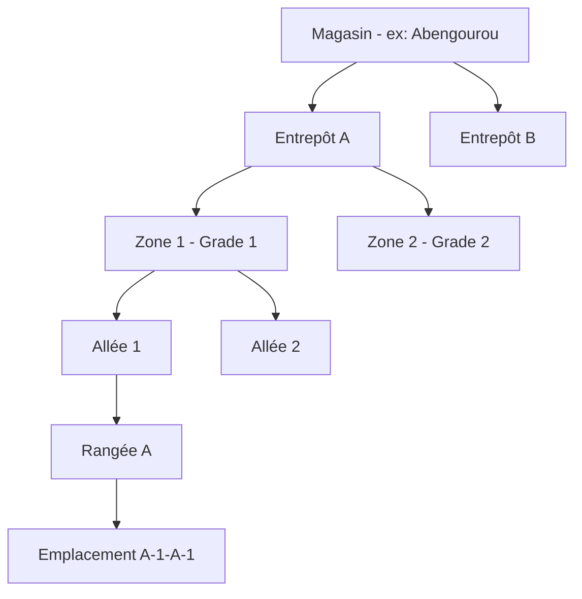
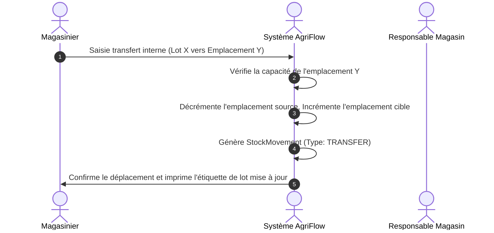
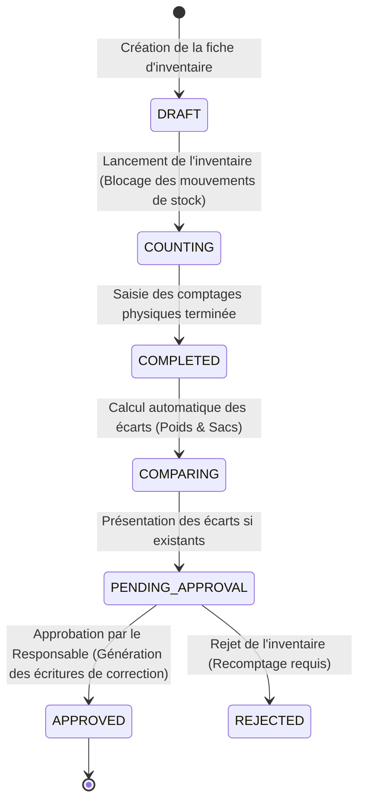

# Conception Technique et Fonctionnelle — Gestion des Magasins et Entrepôts (Module 9)

Ce document présente l'architecture logicielle, le modèle de données, les workflows de mouvement de stock, la gestion des inventaires, les routes d'API, l'interface utilisateur, le fonctionnement en mode déconnecté, la sécurité et la stratégie de test pour le module de **Gestion des Magasins et Entrepôts** au sein de l'ERP AgriFlow. Il est conçu pour être directement exploitable par l'équipe de développement.

---

## 1. Objectifs du Module

Le module de Gestion des Magasins et Entrepôts a pour buts de :
- **Modéliser** la structure physique de stockage de l'entreprise sur plusieurs niveaux (Magasins, Entrepôts, Zones, Allées, Rangées, Emplacements).
- **Suivre en temps réel** la capacité de stockage (poids maximum, sacs maximums, taux d'occupation, capacité restante).
- **Tracer tous les mouvements de stock** physiques et virtuels (entrées, sorties, transferts internes, corrections, écarts d'inventaire).
- **Gérer les affectations** du personnel (Responsables de magasins, magasiniers, contrôleurs qualité).
- **Gérer les processus d'inventaire** partiels ou complets avec un workflow robuste de validation des écarts.
- **Fournir des indicateurs décisionnels** via un tableau de bord par magasin.

---

## 2. Création d'un Magasin

Chaque magasin physique de l'entreprise est enregistré via un formulaire comprenant les informations suivantes :

### 2.1. Informations Générales
- **Code magasin** : Généré automatiquement au format `MAG-YYYY-[Région]-[Séquentiel]` (ex : `MAG-2026-EST-003`).
- **Nom du magasin** : Libellé descriptif (ex: "Magasin Régional Abengourou").
- **Type de magasin** : `COLLECTE` (magasin de brousse), `STOCKAGE` (magasin intermédiaire), `TRANSIT` (port d'attache), `EXPORT` (entrepôt portuaire final).
- **Société / Coopérative propriétaire** : Entité juridique de rattachement.
- **Responsable principal** : Lien vers la table `User` (rôle `RESPONSABLE_MAGASIN` ou `DIRECTEUR`).
- **Coordonnées de contact** : Téléphone et Adresse email.
- **Localisation géographique complète** : Pays, Région, Département, Arrondissement, Ville / Village.
- **Coordonnées GPS** : Latitude & Longitude (permettant la cartographie).
- **Date de création** : Saisie ou automatique.
- **Statut** : `ACTIVE` (ouvert), `CLOSED` (fermé), `MAINTENANCE` (en inventaire ou travaux).

---

## 3. Gestion des Entrepôts, Zones et Emplacements Internes

Pour permettre une traçabilité précise de chaque lot de cacao et optimiser le chargement/déchargement, les magasins sont divisés en sous-structures physiques :



### 3.1. Niveaux de localisation physique
- **Entrepôt (`Warehouse`)** : Bâtiment physique distinct au sein du magasin.
- **Zone (`StorageZone`)** : Section logique ou physique dédiée à une qualité de cacao spécifique (ex : fèves Grade 1 certifiées, cacao conventionnel, sous-grade).
- **Allée (`Aisle`)** : Couloir d'accès.
- **Rangée (`Row`)** : Division linéaire dans l'allée.
- **Emplacement (`Location`)** : Cellule finale de stockage (ex : une dalle ou une palette) portant un code unique de type `LOC-AA-01-A-12` (Allée-Rangée-Hauteur-Position).

---

## 4. Suivi des Capacités de Stockage

Le système effectue des calculs automatiques d'agrégation de poids à chaque mouvement de stock :

- **Capacité maximale (kg et tonnes)** : Configurée à la création de chaque entrepôt/magasin.
- **Capacité utilisée** : Somme des poids nets de cacao présents dans les emplacements du magasin.
- **Capacité restante** : `Capacité maximale - Capacité utilisée`.
- **Nombre de sacs** : Décompte physique des sacs de jute ou plastique en stock.
- **Taux d'occupation (%)** : `(Capacité utilisée / Capacité maximale) * 100`.

> [!IMPORTANT]
> **Alertes de Saturation :** Dès que le taux d'occupation franchit **85%** (seuil configurable), une notification visuelle s'affiche sur le tableau de bord et une alerte système critique est envoyée par e-mail/push aux responsables.

---

## 5. Gestion des Responsables et Rôles

Le personnel est affecté aux magasins avec des rôles et responsabilités distincts :
- **Responsable de Magasin** : Pilote les inventaires, valide les mouvements exceptionnels et surveille les alertes de capacité.
- **Magasinier** : Saisit les pesées brutes, enregistre les transferts d'emplacements et fait le comptage physique.
- **Contrôleur Qualité** : Effectue les cut-tests à la réception et certifie les lots avant entreposage.

---

## 6. Flux des Mouvements Internes et Traçabilité

Toute entrée ou sortie physique de cacao doit donner lieu à l'enregistrement d'un mouvement de stock (`StockMovement`) non modifiable.



### Types de mouvements gérés :
1. `IN_PURCHASE` : Entrée de stock suite à un achat auprès d'un planteur ou sous-acheteur.
2. `OUT_SALE` : Sortie de stock suite à une vente ou expédition exportateur.
3. `INTERNAL_TRANSFER` : Déplacement de cacao entre deux emplacements du même magasin.
4. `INTER_STORE_TRANSFER` : Expédition ou réception entre deux magasins différents.
5. `INVENTORY_CORRECTION` : Ajustement suite à un inventaire approuvé.

---

## 7. Gestion des Inventaires et Validation des Écarts

Le module d'inventaire permet de rapprocher périodiquement le stock théorique (calculé par le système) et le stock physique (compté par les magasiniers).



### 7.1. Workflow de gestion des écarts
- **Écart Positif (Physique > Théorique)** : Le système génère une écriture de correction positive de type `INVENTORY_CORRECTION`.
- **Écart Négatif (Physique < Théorique - ex: perte d'humidité, vol)** : Requiert une justification textuelle obligatoire. Si l'écart dépasse **2%** du volume total du magasin, la validation du **Directeur Général** est requise en plus de celle du Responsable Magasin.

---

## 8. Tableau de Bord Magasin (KPIs & Visualisation)

Chaque magasin dispose d'un écran dédié présentant :
- **Indicateurs clés (KPIs)** : Poids total en stock, Valeur marchande estimée (poids * prix campagne), Taux d'occupation en jauge dynamique.
- **Cartographie 2D des emplacements** : Grille visuelle montrant chaque emplacement coloré selon son taux d'occupation (Vert: vide/peu occupé, Orange: occupé, Rouge: plein).
- **Graphiques** : Évolution mensuelle des entrées/sorties (Histogramme empilé).
- **Registre des 10 derniers mouvements** et des alertes actives.

---

## 9. Paramétrage des Alertes Automatiques

| Type d'Alerte | Déclencheur | Canal de Notification |
| :--- | :--- | :--- |
| `CAPACITY_WARNING` | Occupation >= 80% | Toast UI + E-mail Responsable |
| `CAPACITY_CRITICAL` | Occupation >= 92% | Alerte Rouge Dashboard + Notification Push Directeur |
| `INVENTORY_LATE` | Aucun inventaire complet depuis > 30 jours | Notification Slack/Email Responsable |
| `INVENTORY_GAP` | Écart de comptage > 1.5% | Notification Push Directeur |
| `ZONE_SATURATED` | Zone spécifique occupée à 100% | Blocage automatique des entrées sur cette zone |

---

## 10. Matrice des Droits et Permissions

| Opération | Administrateur | Directeur | Responsable Magasin | Magasinier | Comptable | Auditeur |
| :--- | :---: | :---: | :---: | :---: | :---: | :---: |
| Créer un Magasin | **Oui** | **Oui** | Non | Non | Non | Non |
| Configurer Zones & Emplacements | **Oui** | Non | **Oui** | Non | Non | Non |
| Saisir une Entrée/Sortie (Pesée) | **Oui** | Non | **Oui** | **Oui** | Non | Non |
| Effectuer un Transfert Interne | **Oui** | Non | **Oui** | **Oui** | Non | Non |
| Créer/Saisir un Inventaire | **Oui** | Non | **Oui** | **Oui** | Non | Non |
| Valider les Écarts d'Inventaire | **Oui** | **Oui** | **Oui** (si < 2%) | Non | Non | Non |
| Consulter les Rapports & Stocks | **Oui** | **Oui** | **Oui** | **Oui** | **Oui** | **Oui** |

---

## 11. Modèle de Données (Prisma Schema)

```prisma
enum StoreType {
  COLLECTE
  STOCKAGE
  TRANSIT
  EXPORT
}

enum StoreStatus {
  ACTIVE
  CLOSED
  MAINTENANCE
}

enum StockMovementType {
  IN_PURCHASE
  OUT_SALE
  INTERNAL_TRANSFER
  INTER_STORE_TRANSFER
  INVENTORY_CORRECTION
}

enum InventoryStatus {
  DRAFT
  COUNTING
  COMPLETED
  PENDING_APPROVAL
  APPROVED
  REJECTED
}

model Warehouse {
  id              String         @id @default(uuid()) @db.Uuid
  storeId         String         @db.Uuid @map("store_id")
  store           Store          @relation(fields: [storeId], references: [id], onDelete: Cascade)
  name            String
  capacityTonnes  Float          @map("capacity_tonnes")
  storageZones    StorageZone[]
  createdAt       DateTime       @default(now()) @map("created_at")
  updatedAt       DateTime       @updatedAt @map("updated_at")

  @@map("warehouses")
}

model StorageZone {
  id              String         @id @default(uuid()) @db.Uuid
  warehouseId     String         @db.Uuid @map("warehouse_id")
  warehouse       Warehouse      @relation(fields: [warehouseId], references: [id], onDelete: Cascade)
  name            String
  cocoaGrade      String         @default("GRADE_1") @map("cocoa_grade") // GRADE_1, GRADE_2, SOUS_GRADE
  locations       StorageLocation[]
  createdAt       DateTime       @default(now()) @map("created_at")
  updatedAt       DateTime       @updatedAt @map("updated_at")

  @@map("storage_zones")
}

model StorageLocation {
  id              String            @id @default(uuid()) @db.Uuid
  zoneId          String            @db.Uuid @map("zone_id")
  zone            StorageZone       @relation(fields: [zoneId], references: [id], onDelete: Cascade)
  code            String            @unique // LOC-AA-01-A-12
  capacityKg      Float             @default(5000) @map("capacity_kg")
  currentWeightKg Float             @default(0.0) @map("current_weight_kg")
  currentBags     Int               @default(0) @map("current_bags")
  
  // Relations historiques
  sourceMovements      DetailedStockMovement[] @relation("SourceLocation")
  destinationMovements DetailedStockMovement[] @relation("DestinationLocation")
  inventoryItems       InventoryItem[]
  
  createdAt       DateTime          @default(now()) @map("created_at")
  updatedAt       DateTime          @updatedAt @map("updated_at")

  @@map("storage_locations")
}

model DetailedStockMovement {
  id                String            @id @default(uuid()) @db.Uuid
  type              StockMovementType
  weightKg          Float             @map("weight_kg")
  bagCount          Int               @map("bag_count")
  
  // Localisations physiques précises
  sourceLocationId  String?           @db.Uuid @map("source_location_id")
  sourceLocation    StorageLocation?  @relation("SourceLocation", fields: [sourceLocationId], references: [id])
  destLocationId    String?           @db.Uuid @map("dest_location_id")
  destLocation      StorageLocation?  @relation("DestinationLocation", fields: [destLocationId], references: [id])
  
  // Référence magasin global (déjà existante dans schema.prisma pour StockMovement)
  storeId           String            @db.Uuid @map("store_id")
  store             Store             @relation(fields: [storeId], references: [id])
  
  createdById       String            @db.Uuid @map("created_by_id")
  createdBy         User              @relation(fields: [createdById], references: [id])
  
  referenceId       String?           @db.Uuid @map("reference_id") // ID achat, vente, transfert ou inventaire
  date              DateTime          @default(now())
  createdAt         DateTime          @default(now()) @map("created_at")

  @@index([date])
  @@map("detailed_stock_movements")
}

model Inventory {
  id              String         @id @default(uuid()) @db.Uuid
  inventoryNumber String         @unique @map("inventory_number") // INV-YYYYMM-XXXX
  status          InventoryStatus @default(DRAFT)
  storeId         String         @db.Uuid @map("store_id")
  store           Store          @relation(fields: [storeId], references: [id], onDelete: Cascade)
  
  createdById     String         @db.Uuid @map("created_by_id")
  createdBy       User           @relation("InventoryCreator", fields: [createdById], references: [id])
  validatedById   String?        @db.Uuid @map("validated_by_id")
  validatedBy     User?          @relation("InventoryValidator", fields: [validatedById], references: [id])
  
  items           InventoryItem[]
  gapComment      String?        @db.Text @map("gap_comment")
  
  startDate       DateTime       @map("start_date")
  endDate         DateTime?      @map("end_date")
  createdAt       DateTime       @default(now()) @map("created_at")
  updatedAt       DateTime       @updatedAt @map("updated_at")

  @@map("inventories")
}

model InventoryItem {
  id                 String          @id @default(uuid()) @db.Uuid
  inventoryId        String          @db.Uuid @map("inventory_id")
  inventory          Inventory       @relation(fields: [inventoryId], references: [id], onDelete: Cascade)
  locationId         String          @db.Uuid @map("location_id")
  location           StorageLocation @relation(fields: [locationId], references: [id])
  
  theoreticalWeight  Float           @map("theoretical_weight")
  theoreticalBags    Int             @map("theoretical_bags")
  physicalWeight     Float           @map("physical_weight")
  physicalBags       Int             @map("physical_bags")
  
  weightGap          Float           @map("weight_gap") // physicalWeight - theoreticalWeight
  bagsGap            Int             @map("bags_gap")
  
  createdAt          DateTime        @default(now()) @map("created_at")

  @@map("inventory_items")
}
```

---

## 12. Spécification des APIs REST

Toutes les APIs requièrent une authentification par JWT Token et renvoient des codes d'erreurs standards (400 Bad Request, 401 Unauthorized, 403 Forbidden, 404 Not Found).

### 12.1. Créer un magasin
- **Route** : `POST /api/v1/stores`
- **Permissions** : `ADMIN`, `DIRECTEUR`
- **Body JSON** :
  ```json
  {
    "name": "Magasin Régional Abengourou",
    "type": "STOCKAGE",
    "responsibleId": "e2d83b4c-9f0a-4a2c-9a1d-a0b2c3d4e5f6",
    "phone": "+2250707070707",
    "address": "Zone Industrielle Abengourou",
    "country": "Côte d'Ivoire",
    "region": "Indénié-Djuablin",
    "capacityTonnes": 150.0,
    "gpsLatitude": 6.72,
    "gpsLongitude": -3.48
  }
  ```
- **Réponse (201 Created)** : Renvoie l'objet Store créé.

### 12.2. Enregistrer un mouvement de stock
- **Route** : `POST /api/v1/stores/movements`
- **Permissions** : `MAGASINIER`, `RESPONSABLE_MAGASIN`, `ADMIN`
- **Body JSON** :
  ```json
  {
    "type": "INTERNAL_TRANSFER",
    "weightKg": 2500,
    "bagCount": 38,
    "sourceLocationId": "a1b2c3d4-e5f6-7a8b-9c0d-1e2f3a4b5c6d",
    "destLocationId": "f9e8d7c6-b5a4-3f2e-1d0c-9b8a7f6e5d4c",
    "storeId": "abengourou-store-id"
  }
  ```

---

## 13. Interfaces Utilisateurs (UI/UX)

L'interface doit être sombre, hautement lisible et optimisée pour l'affichage en hangar de stockage (forte luminosité ou contrastes élevés).

- **Fiche Magasin & Plan interactive** : Représentation schématique en grille 2D des allées et emplacements. Les cases cliquables révèlent le lot de cacao présent, sa date d'entrée, et son humidité d'origine.
- **Console d'inventaire mobile** : Conçue pour être manipulée sur smartphone avec de gros boutons numériques pour faciliter la saisie rapide des comptages physiques par les magasiniers portant des gants.

---

## 14. Fonctionnement Hors Ligne (Offline Management)

Les inventaires de fin de campagne se font souvent dans des hangars métalliques faisant cage de Faraday (perte totale de réseau cellulaire).

- **Stockage local des feuilles d'inventaire** : Lorsque le magasinier initie un inventaire, la liste complète des emplacements du magasin et leurs poids théoriques sont chargés dans le cache `IndexedDB` du smartphone.
- **Saisie en mode déconnecté** : Le magasinier saisit ses mesures et les valide localement.
- **Synchronisation au retour du réseau** : Dès que l'application détecte un signal, elle pousse la feuille d'inventaire vers `/api/v1/inventories/sync`. En cas de conflit, le comptage physique horodaté le plus récent prévaut.

---

## 15. Sécurité et Journal d'Audit

- **Immutabilité des mouvements de stock** : Une fois un mouvement de stock créé, il est impossible de le modifier ou de le supprimer. Seule une écriture inverse ou d'ajustement est autorisée (principe de comptabilité double).
- **Double signature obligatoire pour les écarts** : Tout écart d'inventaire de plus de 2% du stock théorique requiert une validation conjointe par clé TOTP (double signature numérique) du Responsable de Magasin et du Directeur Général.

---

## 16. Plan de Tests

### 16.1. Tests de Cas Limites
1. **Saturation d'emplacement** : Tenter d'insérer 6000 kg dans un emplacement configuré pour 5000 kg maximum. Valider le blocage de l'API avec un code 400.
2. **Double transfert concurrent** : Simuler deux magasiniers transférant le même lot de cacao vers deux emplacements différents au même instant. Valider que le mécanisme de verrouillage optimiste de Prisma rejette la seconde transaction.

### 16.2. Tests de Sécurité (Rôles)
- Tenter d'approuver un écart d'inventaire avec le rôle `MAGASINIER`. Valider le renvoi d'un code 403.
