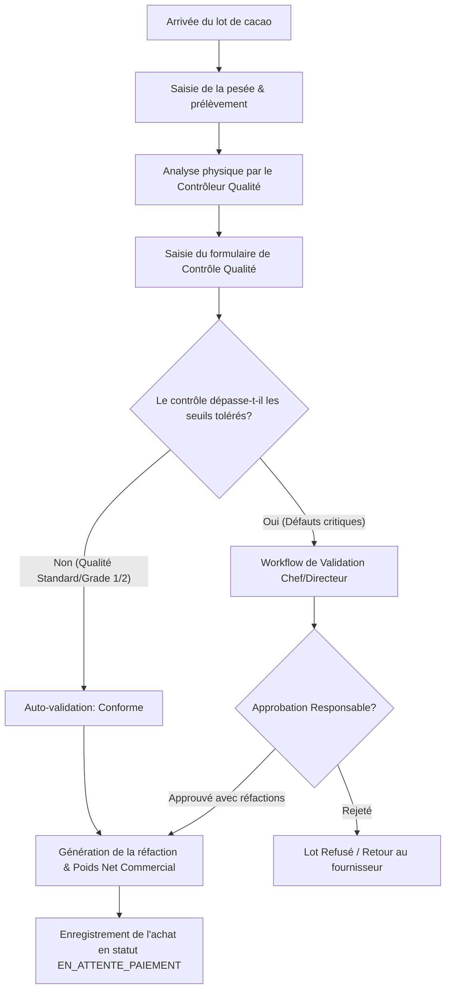

# Conception Technique et Fonctionnelle — Gestion des Réfactions et du Contrôle Qualité (Module 8)

Ce document présente l'architecture logicielle, le modèle de données, le workflow de validation, les routes d'API, l'interface utilisateur, le fonctionnement en mode déconnecté, la sécurité et la stratégie de test pour le module de **Gestion des Réfactions et du Contrôle Qualité** au sein de l'ERP AgriFlow. Il est conçu pour être directement exploitable par l'équipe de développement.

---

## 1. Objectifs du Module

Le module de Gestion des Réfactions et du Contrôle Qualité a pour buts de :
- **Enregistrer** les résultats d'analyses physiques et visuelles de chaque lot de cacao reçu.
- **Calculer automatiquement** les déductions de poids (réfactions) et les pénalités financières applicables selon les règles en vigueur.
- **Garantir une traçabilité complète** de la qualité, du producteur jusqu'à l'entrepôt central.
- **Workflow de validation** à plusieurs niveaux pour bloquer les lots non conformes ou exiger des approbations de responsables en cas de dépassement de seuil.
- **Analyser l'évolution de la qualité** par région, magasin, chef de zone, sous-acheteur et planteur.

---

## 2. Paramétrage Dynamique des Règles de Réfactions

Pour permettre à l'entreprise de modifier sa politique commerciale sans changer le code de l'application, les règles de réfaction sont entièrement configurables via une interface d'administration.

### 2.1. Critères de Qualité Pris en Charge

| Code Critère | Libellé | Seuil Acceptable (Standard) | Unité | Méthode de calcul |
| :--- | :--- | :--- | :--- | :--- |
| `HUMIDITE` | Taux d'humidité | <= 8.0 % | % | Pénalité linéaire si > 8% et <= 10%, doublée si > 10% |
| `DECHETS` | Taux d'impuretés / poussières | <= 1.0 % | % | Déduction de poids linéaire |
| `MOISIES` | Fèves moisies | <= 3.0 % | % | Déduction de poids linéaire ou rejet du lot si > 10% |
| `ARDOISED` | Fèves ardoisées | <= 3.0 % | % | Déduction de poids ou déclassement |
| `INSECTE` | Fèves mitées / insectes | <= 1.0 % | % | Déduction de poids |
| `CASSEES` | Fèves cassées / débris | <= 2.0 % | % | Déduction de poids |
| `PLATES` | Fèves plates | <= 2.0 % | % | Déduction de poids |
| `GERMEES` | Fèves germées | <= 1.0 % | % | Déduction de poids |
| `STRANGERS`| Corps étrangers métalliques/cailloux | 0.0 % | % | Rejet automatique ou déduction forfaitaire lourde |
| `HUMID_BAG`| Sacs humides / moisis | 0.0 | Sacs | Déduction forfaitaire par sac humide |

### 2.2. Configuration d'une Règle (`RefactionRule`)

Pour chaque critère, l'administrateur définit :
- **`threshold`** : Valeur seuil (ex: 8.0 pour l'humidité).
- **`penaltyType`** : `WEIGHT_KG` (déduction de poids fixe), `PERCENT_WEIGHT` (déduction de poids en %), `AMOUNT_FCFA` (pénalité financière directe) ou `REJECT` (rejet immédiat).
- **`penaltyValue`** : Facteur de pénalité appliqué au dépassement.
- **`formula`** : Expression mathématique dynamique (ex: `(rate - 8.0) * 1.0` pour l'humidité entre 8% et 10%, et `((rate - 8.0) * 2.0)` pour l'humidité > 10%).
- **`maxLimit`** : Limite absolue au-delà de laquelle le lot est rejeté automatiquement ou requiert une validation du Directeur Général.

---

## 3. Workflow de Contrôle Qualité et Enregistrement

Chaque livraison de cacao doit passer par l'étape de contrôle qualité avant que l'achat ne soit payé.



### 3.1. Structure du Formulaire de Contrôle Qualité

1. **Informations Générales :**
   - Numéro de Contrôle (généré automatiquement : `QC-YYYYMM-XXXX`).
   - Référence d'achat (lié à la pesée brute).
   - Magasin de réception.
   - Nom du contrôleur qualité (rempli automatiquement par la session active).
   - Date et heure du contrôle.
   - Origine (Planteur ou Sous-Acheteur).
2. **Mesures Physiques :**
   - Humidité (%) : Mesurée au conductivimètre/humidimètre.
   - Déchets/Impuretés (%).
   - Grainage (nombre de fèves pour 100g).
   - Fèves défectueuses (%) : Moisies, ardoisées, mitées, cassées, germées, plates.
3. **Aspects Sensoriels :**
   - Odeur : Conforme / Fumée / Acidulée / Moisie.
   - Couleur : Conforme / Ardoisée / Terne.
   - État des sacs : Propres / Humides / Souillés.
4. **Pièces jointes obligatoires en cas de non-conformité :**
   - Photos du prélèvement.
   - Photos des défauts physiques ou des sacs non conformes.
   - Rapport d'analyse scanné.

---

## 4. Calcul Automatique des Réfactions (Moteur de Calcul)

Le moteur de calcul prend le poids net brut du lot (`weightNet` = `weightGross` - `weightBags`) et applique les réfactions de poids de manière cumulative ou prioritaire.

### 4.1. Algorithme de Calcul des Déductions de Poids

```typescript
export interface QualityMetrics {
  moistureRate: number;
  impurityRate: number;
  moldyRate: number;
  slatyRate: number;
  insectRate: number;
  brokenRate: number;
  flatRate: number;
  germinatedRate: number;
  wetBagsCount: number;
}

export function calculateRefactions(
  weightNet: number,
  metrics: QualityMetrics,
  rules: any[]
): {
  weightRefactionKg: number;
  weightNetPaid: number;
  qualityGrade: 'GRADE_1' | 'GRADE_2' | 'SOUS_GRADE';
  details: Record<string, number>;
} {
  let totalRefactionKg = 0;
  const details: Record<string, number> = {};

  // 1. Calcul Réfaction Humidité
  // Standard : 8.0%. Si entre 8% et 10%: réfaction linéaire de poids. Si > 10%: réfaction doublée.
  if (metrics.moistureRate > 8.0) {
    let moistureRefaction = 0;
    if (metrics.moistureRate <= 10.0) {
      moistureRefaction = weightNet * ((metrics.moistureRate - 8.0) / 100);
    } else {
      moistureRefaction = weightNet * (((metrics.moistureRate - 8.0) * 2.0) / 100);
    }
    details['HUMIDITE'] = Math.round(moistureRefaction * 100) / 100;
    totalRefactionKg += moistureRefaction;
  }

  // 2. Calcul Réfaction Déchets (Impuretés)
  // Standard : 1.0%. Réfaction de poids linéaire pour tout dépassement.
  if (metrics.impurityRate > 1.0) {
    const impurityRefaction = weightNet * ((metrics.impurityRate - 1.0) / 100);
    details['DECHETS'] = Math.round(impurityRefaction * 100) / 100;
    totalRefactionKg += impurityRefaction;
  }

  // 3. Réfaction Sacs Humides
  if (metrics.wetBagsCount > 0) {
    const wetBagsRefaction = metrics.wetBagsCount * 1.5; // 1.5kg de pénalité par sac humide
    details['SACS_HUMIDES'] = wetBagsRefaction;
    totalRefactionKg += wetBagsRefaction;
  }

  // 4. Détermination du Grade Qualité
  let qualityGrade: 'GRADE_1' | 'GRADE_2' | 'SOUS_GRADE' = 'GRADE_1';
  if (metrics.moistureRate > 9.0 || metrics.impurityRate > 2.0 || metrics.moldyRate > 4.0) {
    qualityGrade = 'SOUS_GRADE';
  } else if (metrics.moistureRate > 8.0 || metrics.impurityRate > 1.0 || metrics.moldyRate > 3.0) {
    qualityGrade = 'GRADE_2';
  }

  const finalRefaction = Math.min(totalRefactionKg, weightNet); // Ne pas dépasser le poids initial
  const weightNetPaid = Math.max(0, weightNet - finalRefaction);

  return {
    weightRefactionKg: Math.round(finalRefaction * 100) / 100,
    weightNetPaid: Math.round(weightNetPaid * 100) / 100,
    qualityGrade,
    details
  };
}
```

---

## 5. Modèle de Données (Prisma / PostgreSQL)

Pour stocker ces structures de données, nous ajoutons les modèles suivants au schéma de base de données :

```prisma
enum QualityControlStatus {
  DRAFT
  PENDING_VALIDATION // Soumis à validation d'un responsable
  VALIDATED          // Validé, déblocage du paiement
  REJECTED           // Lot non conforme, renvoyé au planteur/pisteur
  REDO               // Saisie incorrecte, contrôle à refaire
}

enum RefactionPenaltyType {
  WEIGHT_KG
  PERCENT_WEIGHT
  AMOUNT_FCFA
  REJECT
}

model RefactionRule {
  id              String               @id @default(uuid()) @db.Uuid
  code            String               @unique // ex: "HUMIDITE", "DECHETS"
  name            String
  isActive        Boolean              @default(true) @map("is_active")
  threshold       Float                // Valeur seuil (ex: 8.0)
  penaltyType     RefactionPenaltyType @map("penalty_type")
  penaltyValue    Float                @map("penalty_value")
  formula         String?              // Formule JS/JSON-logic pour calcul dynamique
  maxLimit        Float?               @map("max_limit") // Limite critique de rejet
  createdAt       DateTime             @default(now()) @map("created_at")
  updatedAt       DateTime             @updatedAt @map("updated_at")

  @@map("refaction_rules")
}

model QualityControl {
  id                  String               @id @default(uuid()) @db.Uuid
  controlNumber       String               @unique @map("control_number") // QC-YYYYMM-XXXX
  status              QualityControlStatus @default(VALIDATED)
  
  // Relations d'achat
  purchaseId          String               @unique @db.Uuid @map("purchase_id")
  purchase            Purchase             @relation(fields: [purchaseId], references: [id], onDelete: Cascade)
  
  // Métriques mesurées
  moistureRate        Float                @map("moisture_rate")
  impurityRate        Float                @map("impurity_rate")
  moldyRate           Float                @map("moldy_rate")
  slatyRate           Float                @map("slaty_rate")
  insectRate          Float                @map("insect_rate")
  brokenRate          Float                @map("broken_rate")
  flatRate            Float                @map("flat_rate")
  germinatedRate      Float                @map("germinated_rate")
  grainage            Int
  wetBagsCount        Int                  @default(0) @map("wet_bags_count")
  
  // Aspects sensoriels
  smell               String               @default("CONFORME") // CONFORME, MOISI, FUME
  color               String               @default("CONFORME") // CONFORME, TERNE, ARDOISEE
  bagCondition        String               @default("PROPRE")    // PROPRE, HUMIDE, DECHIRE
  observations        String?              @db.Text
  
  // Résultats des calculs
  weightRefactionKg   Float                @default(0.0) @map("weight_refaction_kg")
  financialLossFCFA   Float                @default(0.0) @map("financial_loss_fcfa") // Estimation perte financière
  
  // Fichiers & Audit
  attachments         QualityAttachment[]
  histories           QualityControlHistory[]
  
  // Validateur
  validatedById       String?              @db.Uuid @map("validated_by_id")
  validatedBy         User?                @relation("ValidatedControls", fields: [validatedById], references: [id])
  controlledById      String               @db.Uuid @map("controlled_by_id")
  controlledBy        User                 @relation("ControlledBy", fields: [controlledById], references: [id])
  
  createdAt           DateTime             @default(now()) @map("created_at")
  updatedAt           DateTime             @updatedAt @map("updated_at")

  @@index([createdAt])
  @@index([status])
  @@map("quality_controls")
}

model QualityAttachment {
  id               String         @id @default(uuid()) @db.Uuid
  qualityControlId String         @db.Uuid @map("quality_control_id")
  qualityControl   QualityControl @relation(fields: [qualityControlId], references: [id], onDelete: Cascade)
  fileName         String         @map("file_name")
  fileUrl          String         @map("file_url")
  fileType         String         @map("file_type") // IMAGE, VIDEO, PDF
  createdAt        DateTime       @default(now()) @map("created_at")

  @@map("quality_attachments")
}

model QualityControlHistory {
  id               String               @id @default(uuid()) @db.Uuid
  qualityControlId String               @db.Uuid @map("quality_control_id")
  qualityControl   QualityControl       @relation(fields: [qualityControlId], references: [id], onDelete: Cascade)
  statusBefore     QualityControlStatus @map("status_before")
  statusAfter      QualityControlStatus @map("status_after")
  comment          String?              @db.Text
  userId           String               @db.Uuid @map("user_id")
  user             User                 @relation(fields: [userId], references: [id])
  createdAt        DateTime             @default(now()) @map("created_at")

  @@map("quality_control_histories")
}
```

---

## 6. API REST Spécifications

Toutes les requêtes de contrôle qualité requièrent une authentification par Token JWT et sont gérées sous le préfixe `/api/v1/quality-controls`.

### 6.1. Créer un Contrôle Qualité
- **Route :** `POST /api/v1/quality-controls`
- **Permissions :** `MAGASINIER`, `RESPONSABLE_QUALITE`, `ADMIN`
- **Body JSON :**
  ```json
  {
    "purchaseId": "e2d83b4c-9f0a-4a2c-9a1d-a0b2c3d4e5f6",
    "moistureRate": 9.2,
    "impurityRate": 1.5,
    "moldyRate": 2.0,
    "slatyRate": 1.0,
    "insectRate": 0.5,
    "brokenRate": 1.2,
    "flatRate": 0.8,
    "germinatedRate": 0.0,
    "grainage": 98,
    "wetBagsCount": 1,
    "smell": "CONFORME",
    "color": "CONFORME",
    "bagCondition": "HUMIDE",
    "observations": "Légère humidité sur un sac au fond du camion."
  }
  ```
- **Réponse Réussite (201 Created) :**
  ```json
  {
    "id": "a1b2c3d4-e5f6-7a8b-9c0d-1e2f3a4b5c6d",
    "controlNumber": "QC-202607-0014",
    "status": "VALIDATED",
    "weightRefactionKg": 14.5,
    "financialLossFCFA": 13050,
    "qualityGrade": "GRADE_2"
  }
  ```

### 6.2. Soumettre pour Validation Supérieure (si anomalies ou hors-seuil)
- **Route :** `POST /api/v1/quality-controls/:id/submit-validation`
- **Body JSON :** `{ "comment": "Taux d'humidité élevé (10.5%), approbation requise." }`
- **Réponse (200 OK) :** `{ "id": "...", "status": "PENDING_VALIDATION" }`

### 6.3. Valider financièrement un contrôle qualité
- **Route :** `POST /api/v1/quality-controls/:id/approve`
- **Permissions :** `RESPONSABLE_QUALITE`, `DIRECTEUR`, `ADMIN`
- **Réponse (200 OK) :** `{ "id": "...", "status": "VALIDATED", "validatedAt": "..." }`

---

## 7. Interface Utilisateur (UI/UX)

L'interface doit être conçue en **responsive design** pour s'adapter aux terminaux mobiles utilisés par les contrôleurs directement dans les zones de pesée.

### 7.1. Écran de saisie mobile (Tablette / Smartphone)
- **Indicateurs de couleurs dynamiques :** Lorsque le contrôleur saisit une valeur d'humidité :
  - `< 8.0%` : Vert (Qualité optimale).
  - `8.1% - 10.0%` : Orange (Alerte, calcul d'une réfaction automatique).
  - `> 10.0%` : Rouge (Critique, blocage du lot ou validation double requise).
- **Module Caméra :** Intégration d'un bouton d'appareil photo direct pour prendre les clichés des défauts physiques et les joindre instantanément au contrôle.

### 7.2. Tableau de bord qualité (Desktop)
- **Graphique en secteur :** Répartition des grades de cacao achetés (Grade 1 / Grade 2 / Sous-Grade) par campagne.
- **Courbe d'évolution :** Suivi mensuel du taux d'humidité moyen par coopérative pour détecter les problèmes de séchage en saison des pluies.

---

## 8. Mode Hors Ligne (Offline Management)

Les centres de collecte et magasins d'achat en zone rurale souffrent fréquemment d'une absence complète de réseau internet.

### 8.1. Architecture Hors Ligne
- **IndexedDB (Local Storage) :** Si l'application web ou l'application mobile détecte l'absence de réseau (`navigator.onLine === false`), elle bascule en mode stockage local sécurisé.
- **Saisie du Contrôle :** Le contrôleur remplit le formulaire et prend des photos normalement. Le système calcule les réfactions en utilisant un script local reproduisant le moteur de calcul. Le contrôle est stocké localement avec le statut `DRAFT_OFFLINE`.
- **Synchronisation automatique :** Dès le retour d'une connexion internet stable, un Service Worker intercepte l'événement de reconnexion et envoie en rafale (batch) les contrôles en attente vers le serveur backend `/api/v1/quality-controls/sync`.

### 8.2. Résolution des conflits de synchronisation
Si un lot de cacao a été modifié sur le serveur et sur le poste de saisie local, la règle **"Poids/Qualité de la balance physique du magasin l'emporte"** est appliquée.

---

## 9. Sécurité et Journal d'Audit

Le contrôle de la qualité impactant directement le prix payé aux planteurs, c'est une zone sensible aux fraudes (ex: complaisance sur les mesures d'humidité).

- **Non-mutabilité après validation :** Dès qu'un contrôle qualité passe au statut `VALIDATED` (ou `REJECTED`), il devient en lecture seule. Aucune modification de métrique (ex: taux d'humidité) n'est possible, sauf par un Administrateur Général via une double confirmation MFA.
- **Journal d'Audit Intégral :** Chaque modification de critère ou de statut génère une ligne dans `QualityControlHistory` avec l'adresse IP de l'utilisateur, l'appareil utilisé et les anciennes valeurs modifiées.
- **Journal de modification des règles :** Toute modification des seuils de réfaction par l'administrateur fait l'objet d'une alerte immédiate envoyée par e-mail au Directeur Général.

---

## 10. Plan de Tests

### 10.1. Tests Fonctionnels (Cas Limites)
1. **Pénalité Humidité 8.5% :** Vérifier que le poids de réfaction appliqué est exactement linéaire de `(8.5 - 8.0) = 0.5%` du poids net.
2. **Pénalité Humidité 11.2% :** Vérifier que la pénalité est doublée pour le calcul de réfaction.
3. **Rejet Critique :** Introduire un taux d'impuretés de 15%. Confirmer que le système refuse la transaction d'achat et notifie le Responsable Qualité.

### 10.2. Tests de Performance en Mode Hors Ligne
- Simuler la coupure réseau de l'appareil.
- Enregistrer 150 contrôles qualité avec pièces jointes (photos compressées).
- Rétablir le réseau et mesurer le temps de synchronisation (objectif : < 15 secondes pour le transfert des métriques et des fichiers compressés).
