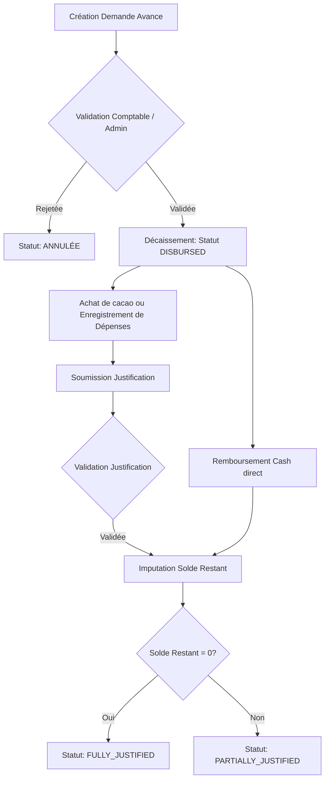

# AgriFlow — Dossier de Conception Technique et Fonctionnelle
## Module 4 : Gestion des Sous-acheteurs

---

## 1. Objectif du Module

Le module **Gestion des Sous-acheteurs** (aussi appelés « pisteurs » ou « collecteurs ») est un pilier critique d'AgriFlow. Dans la chaîne logistique du cacao en Afrique de l'Ouest (notamment en Côte d'Ivoire et au Cameroun), les sous-acheteurs agissent comme intermédiaires sur le terrain. Ils reçoivent des avances de fonds de la part de l'exportateur ou de la coopérative, se rendent dans les campements reculés pour acheter le cacao aux planteurs, puis livrent le cacao physique aux magasins de stockage.

Ce module a pour objectifs de :
* **Sécuriser les flux financiers :** Suivre les avances de fonds accordées, les plafonds de crédit et le solde disponible en temps réel.
* **Maîtriser les flux de matière :** Suivre les achats de cacao sur le terrain et réconcilier les quantités achetées avec celles livrées aux magasins (contrôle des pertes).
* **Analyser la performance :** Mesurer la rentabilité de chaque sous-acheteur, son coût de revient, son taux de perte et le niveau d'activité de ses planteurs.
* **Garantir le fonctionnement en zone blanche :** Permettre la collecte des données d'achat hors-ligne via l'application mobile et gérer la synchronisation ultérieure sans perte de données.

---

## 2. Création et Fiche Profil d'un Sous-acheteur

Le sous-acheteur est modélisé dans AgriFlow comme un utilisateur (`User`) possédant le rôle spécifique `SOUS_ACHETEUR`. Pour éviter de surcharger la table principale `users`, ses informations spécifiques sont gérées via un modèle lié `SubBuyerProfile` (relation 1-to-1).

### Formulaire d'Enregistrement

Le formulaire de création comprend trois sections distinctes :

#### A. Informations Personnelles
* **Numéro automatique :** Identifiant unique généré par le système selon le format `SA-YYYY-MM-XXXX` (ex: `SA-2026-07-0042`).
* **Nom & Prénom :** Identité légale du sous-acheteur.
* **Sexe :** `M` ou `F`.
* **Date de naissance :** Requis pour vérifier la majorité légale et pour le profil d'identification.
* **Photo :** Fichier image (JPEG/PNG) stocké sur un espace de stockage cloud sécurisé (ex: AWS S3 ou Firebase Storage).
* **Téléphones :** Numéro principal (obligatoire, servant d'identifiant Mobile Money si applicable) et numéro secondaire.
* **E-mail :** Optionnel (les sous-acheteurs en zone rurale communiquent principalement par téléphone).
* **Adresse physique :** Domiciliation du sous-acheteur.

#### B. Pièce d'Identité (Obligatoire pour la conformité et KYC)
* **Type de pièce :** Liste déroulante (`CNI`, `PASSEPORT`, `CARTE_CONSULAIRE`, `PERMIS_DE_CONDUIRE`).
* **Numéro :** Numéro de série de la pièce.
* **Date d'expiration :** Date limite de validité.
* **Photo recto :** Scan/Photo claire de la face avant.
* **Photo verso :** Scan/Photo claire de la face arrière (si applicable).

#### C. Informations Professionnelles & Géographiques
* **Magasin de rattachement :** Point de livraison habituel (clé étrangère vers la table `Store`).
* **Chef de zone responsable :** Superviseur direct (clé étrangère vers la table `User` ayant le rôle `CHEF_DE_ZONE`).
* **Découpage territorial d'achat :**
  * **Région :** Région administrative (ex: Nawa, Indénié-Djuablin).
  * **Département :** Département d'action (ex: Soubré, Abengourou).
  * **Arrondissement / Sous-préfecture :** Zone administrative locale.
  * **Village principal :** Point d'ancrage terrain.
  * **Zone d'achat :** Libellé de la zone commerciale personnalisée.
* **Date de début de collaboration :** Date de signature du contrat ou du premier octroi de fonds.
* **Plafond d'avance autorisé :** Montant maximal cumulé d'avances non justifiées autorisé (en FCFA).
* **Statut :** 
  * `ACTIF` (opérations autorisées).
  * `SUSPENDU` (bloqué temporairement pour non-justification d'avances ou litige).
  * `INACTIF` (collaboration terminée).

---

## 3. Tableau de Bord (Dashboard) du Sous-acheteur

La fiche détaillée d'un sous-acheteur affiche un tableau de bord consolidé pour piloter son activité financière et physique en temps réel.

```
+---------------------------------------------------------------------------------+
|                               FICHE SOUS-ACHETEUR                               |
| Kouassi Yao (SA-2026-07-0001) - Statut: ACTIF                                   |
+------------------------------------+--------------------------------------------+
| FINANCES (FCFA)                    | VOLUMES DE CACAO (Kg)                      |
| * Solde Actuel : 450 000           | * Acheté Aujourd'hui : 650 Kg              |
| * Avances Reçues : 5 000 000       | * Acheté ce Mois : 12 400 Kg               |
| * Avances non Justifiées : 750 000 | * Acheté cette Année : 89 200 Kg           |
+------------------------------------+--------------------------------------------+
| OPÉRATIONS ET LOGISTIQUE           | PERFORMANCE ET QUALITÉ                     |
| * Planteurs Actifs : 18            | * Coût Moyen d'Achat : 1 620 FCFA/Kg       |
| * Nombre de Livraisons : 14        | * Prix Moyen Planteur : 1 500 FCFA/Kg      |
| * Pertes cumulées : 120 Kg (0.13%) | * Score Performance : 94/100 (Excellent)   |
+------------------------------------+--------------------------------------------+
```

### Formules de calcul des indicateurs :
* **Solde disponible (Solde Actuel) :** `Avances Reçues - (Achats validés + Dépenses validées + Remboursements cash)`.
* **Avances non justifiées :** Somme des avances dont le statut est `DISBURSED` ou `PARTIALLY_JUSTIFIED`.
* **Nombre de planteurs actifs :** Planteurs rattachés ayant au moins 1 vente enregistrée dans les 30 derniers jours.
* **Coût moyen d'achat par Kg :** `(Valeur des achats terrain + Dépenses opérationnelles validées) / Quantité pesée reçue au magasin`. Ce coût permet de savoir combien le Kg de cacao coûte réellement à la coopérative après logistique du sous-acheteur.
* **Performance globale :** Note sur 100 calculée comme suit :
  $$\text{Score} = (\text{Respect Plafond} \times 0.3) + (\text{Taux de Perte Normalisé} \times 0.4) + (\text{Volume vs Objectif} \times 0.3)$$

---

## 4. Gestion des Avances de Fonds

La gestion des avances de fonds suit le cycle financier traditionnel d'octroi de crédit de campagne.



### Structure d'une Avance
Pour chaque avance accordée, le système enregistre :
* **Numéro automatique :** Code unique `AV-YYYY-MM-XXXX`.
* **Date d'octroi :** Date de décaissement effectif.
* **Montant :** Somme allouée (FCFA).
* **Motif :** Catégorisé (`ACHAT_CACAO`, `LOGISTIQUE_TRANSPORT`, `INTRANTS`, `EXCEPTIONNEL`).
* **Mode de paiement :** `CASH` (caisse coopérative), `MOBILE_MONEY` (Wave, MTN, Orange), `BANK_TRANSFER`, `CHEQUE`.
* **Utilisateur validateur :** Clé étrangère vers l'utilisateur comptable ou administrateur ayant autorisé l'opération.
* **Observations :** Champ de texte libre pour le contexte opérationnel.

### Mécanisme de Justification
Les avances ne sont pas remboursées directement en argent, mais principalement « remboursées » par la livraison de cacao physique acheté aux planteurs.
Le sous-acheteur soumet des justificatifs :
1. **Achats terrain (Fiches d'achats) :** Chaque achat de cacao lie la quantité achetée à une ou plusieurs avances actives.
2. **Frais généraux autorisés :** Frais de transport (piste), achat de sacs en brousse, main-d'œuvre de chargement.
3. **Remboursement Cash :** Si le sous-acheteur restitue le reliquat d'argent non utilisé à la comptabilité.

---

## 5. Achats Réalisés sur le Terrain

Le système centralise l'historique de tous les achats effectués par le sous-acheteur auprès des planteurs en brousse. Ces transactions sont souvent saisies en mode hors-ligne sur l'application mobile.

Chaque ligne d'achat comprend :
* **Date & Heure de transaction :** Horodatage de l'achat physique.
* **Planteur :** Lien vers la table `Planter`.
* **Village :** Lieu d'achat (extrait de la plantation associée au planteur).
* **Poids Brut (Kg) :** Poids total mesuré sur la balance du sous-acheteur.
* **Réfaction (Kg/%) :** Déductions appliquées pour humidité excessive ou impuretés (ex: 2 Kg retirés par sac de 65 Kg).
* **Poids Net (Kg) :** `Poids Brut - Réfaction`. C'est le poids payé au planteur.
* **Prix au Kg (FCFA) :** Prix pratiqué (ne peut être inférieur au prix minimum garanti fixé par l'État/Conseil Café Cacao).
* **Montant Payé (FCFA) :** `Poids Net * Prix au Kg`.
* **Marge Estimée (FCFA) :** Différence entre le prix de transfert coopérative (ex: 1800 FCFA/Kg) et le coût d'achat réel terrain.
* **Magasin de destination prévu :** Point de livraison programmé pour ce lot.

---

## 6. Processus de Livraison au Magasin et Gestion des Écarts

C'est l'étape la plus critique du module, où le flux théorique (déclaratif) rencontre le flux physique (contrôle magasin).

### Le Workflow de Livraison

1. **Déclaration de Départ (Sous-acheteur) :**
   Le sous-acheteur sélectionne sur son application mobile les achats terrain qu'il charge dans son camion. Il déclare :
   * Le nombre de sacs chargés.
   * Le poids total déclaré (somme des poids nets de ces achats).
   * La plaque d'immatriculation du camion.
   * Le statut passe à `SUBMITTED` (Livraison en cours).

2. **Réception et Pesée (Magasinier) :**
   À l'arrivée du camion au magasin régional ou central :
   * Le magasinier pèse les sacs sur la balance certifiée de la coopérative.
   * Il enregistre le nombre de sacs reçus et le poids net mesuré.
   * Il mesure le taux d'humidité (humidimètre) et le taux d'impuretés.

3. **Calcul Automatique des Écarts et des Pertes :**
   Le système applique immédiatement les formules de contrôle :
   * **Écart de Poids (Kg) :** $E_{kg} = \text{Poids Déclaré} - \text{Poids Reçu}$
   * **Taux d'Écart (%) :** $T_{ecart} = \frac{E_{kg}}{\text{Poids Déclaré}} \times 100$

4. **Détection d'Écart Anormal et Alerte :**
   * Un seuil de tolérance (ex: 1.5%) est configuré dans les paramètres du système pour prendre en compte le séchage naturel et la poussière volatilisée pendant le transport en piste.
   * **Si $T_{ecart} \le \text{Seuil}$ :** La livraison est approuvée. Le stock du magasin augmente du *Poids Reçu*. L'avance du sous-acheteur est créditée (justifiée) à hauteur du *Poids Reçu * Prix de Référence*. La perte mineure est comptabilisée dans les pertes logistiques normales de la coopérative.
   * **Si $T_{ecart} > \text{Seuil}$ :** Le système bloque la validation automatique, passe le statut en `LITIGATION` (Litige) et génère une alerte critique (`SystemAlert`) envoyée au Chef de zone et au Comptable. Le sous-acheteur doit justifier l'écart (vol, mouillage de sacs en route, triche sur la balance de brousse).

---

## 7. Portefeuille du Sous-Acheteur (Suivi Comptable)

Le portefeuille est représenté par un grand livre financier dédié au sous-acheteur (`SubBuyerLedger`). C'est un historique immuable de type crédit/débit permettant de recalculer le solde à tout moment.

### Modèle de Données Financier :
* **Crédit financier (Ressources allouées) :** Augmente le solde que le sous-acheteur doit justifier (Avances reçues).
* **Débit financier (Justifications validées) :** Diminue le solde dû (Livraisons de cacao physique validées au prix coopérative, dépenses opérationnelles approuvées, retours de fonds en espèces).

### Exemple d'Historique de Portefeuille :

| Date | Opération | Réf. | Débit (FCFA) | Crédit (FCFA) | Solde Progressif (FCFA) |
| :--- | :--- | :--- | :--- | :--- | :--- |
| 01/07/2026 | Octroi Avance Achat | AV-2026-07-001 | - | 3 000 000 | 3 000 000 (Dû) |
| 03/07/2026 | Dépense Carburant Piste | EXP-2026-004 | 50 000 | - | 2 950 000 (Dû) |
| 05/07/2026 | Livraison Cacao 1.5t | LIV-2026-012 | 2 700 000 | - | 250 000 (Dû) |
| 06/07/2026 | Remboursement Cash Caisse | REMB-2026-02 | 250 000 | - | 0 (Soldé) |

---

## 8. Analyses et Performance (Reporting)

Ce module fournit des outils d'aide à la décision sous forme de graphiques et de classements pour identifier les sous-acheteurs les plus performants et les plus fidèles.

### Graphiques Recommandés :
1. **Évolution des Volumes d'Achats (Bar Chart) :** Comparatif mensuel des tonnages livrés par le sous-acheteur sur la campagne en cours.
2. **Suivi des Pertes de Transport (Line Chart) :** Courbe temporelle du taux d'écart (%) par livraison pour détecter des dérives suspectes de pertes de poids.
3. **Répartition du Portefeuille (Donut Chart) :** Visualisation des avances en cours (Avances utilisées, Avances en attente de livraison, Solde disponible pour achat).

### Classement des Sous-acheteurs (Leaderboard) :
Un tableau de synthèse triable permet d'évaluer les sous-acheteurs selon :
* Le volume total livré (Kg).
* Le taux de perte moyen (%).
* Le respect des délais de justification.
* Le nombre de planteurs actifs recrutés/suivis.

---

## 9. Gestion des Planteurs Rattachés

Le sous-acheteur développe son réseau de planteurs sur le terrain. Le système permet de cartographier et suivre ce réseau de manière dynamique.

* **Relation Structurelle :** Le modèle `Planter` contient un champ optionnel `subBuyerId` reliant le planteur à son sous-acheteur exclusif ou principal pour la campagne.
* **Historique des Transactions par Planteur :**
  * **Liste des Planteurs :** Tableau des producteurs du secteur avec code unique, village et géolocalisation de la plantation.
  * **Quantité Achetée :** Cumul des volumes (Kg) achetés à ce planteur spécifique par le sous-acheteur.
  * **Crédits de Campagne :** Suivi des micro-avances octroyées par le sous-acheteur au planteur (ex: avance pour achat de produits phytosanitaires) et déduites lors des livraisons de cacao.
  * **Paiements en Brousse :** Suivi des reçus de paiements (Cash ou transfert Mobile Money direct).

---

## 10. Système de Notifications et d'Alertes

Le système génère des notifications automatiques (push sur mobile, SMS pour le terrain, et alertes in-app sur le dashboard web de la coopérative) pour les événements suivants :

1. **Alerte Non-Justification d'Avance (Critique) :**
   * *Condition :* Une avance a le statut `DISBURSED` depuis plus de 15 jours sans aucune livraison associée ou déclaration de dépenses.
   * *Destinataires :* Comptable, Chef de zone, Sous-acheteur.

2. **Dépassement du Plafond d'Avances (Bloquant) :**
   * *Condition :* La somme des avances non justifiées dépasse le `creditLimit` configuré dans le profil du sous-acheteur.
   * *Action :* Blocage automatique de toute nouvelle demande d'avance.
   * *Destinataires :* Comptable, Administrateur.

3. **Écart de Poids Important Détecté (Litige) :**
   * *Condition :* Lors d'une pesée au magasin, le taux de perte de la livraison dépasse le seuil configuré (ex: > 2%).
   * *Action :* Livraison marquée en `LITIGATION`.
   * *Destinataires :* Chef de zone, Comptable, Directeur.

4. **Inactivité Terrain Prolongée (Avertissement) :**
   * *Condition :* Aucun achat ni livraison enregistrés pour un sous-acheteur actif pendant 7 jours consécutifs en pleine campagne.
   * *Destinataires :* Chef de zone (pour aller vérifier l'état du pisteur sur le terrain).

5. **Échéance de Remboursement Attendue :**
   * *Condition :* La fin de campagne approche ou une date de remboursement spécifique a été fixée lors de l'octroi d'une avance logistique.
   * *Destinataires :* Comptable, Sous-acheteur.

---

## 11. Matrice des Permissions (RBAC)

Les actions sur le module sont soumises à un contrôle d'accès strict selon les rôles définis dans le système.

| Rôle | Profil Sous-acheteur | Demandes Avances | Validation Avances | Enregistrement Achats | Déclaration Livraison | Pesée Livraison | Rapports Perf. |
| :--- | :--- | :--- | :--- | :--- | :--- | :--- | :--- |
| **Administrateur** | CRUD | CRUD | Valider/Annuler | CRUD | C | Valider | Consulter |
| **Directeur** | R | R | - | R | R | - | Consulter |
| **Comptable** | RU | RU | Valider/Annuler | R | R | - | Consulter |
| **Chef de zone** | RU | RU | - | R | R | - | Consulter |
| **Magasinier** | R | - | - | - | R | Peser/Valider | R |
| **Sous-acheteur** | R (le sien) | R (les siennes) | - | C (hors-ligne) | C (les siennes)| - | R (les siennes)|
| **Auditeur** | R | R | - | R | R | R | Consulter |

*Légende : C = Créer, R = Lire, U = Modifier, D = Supprimer, CRUD = Toutes les actions.*

---

## 12. Structure de la Base de Données (Modèle Physique)

Voici la conception des tables de la base de données PostgreSQL représentée au format **Prisma Schema**.

```prisma
// ==========================================
// 1. Profil Spécifique du Sous-acheteur
// ==========================================
model SubBuyerProfile {
  id                      String            @id @default(uuid()) @db.Uuid
  userId                  String            @unique @db.Uuid @map("user_id")
  user                    User              @relation(fields: [userId], references: [id], onDelete: Cascade)
  
  // Infos personnelles complémentaires
  gender                  String            @default("M") @db.VarChar(1)
  birthDate               DateTime          @map("birth_date") @db.Date
  photoUrl                String?           @map("photo_url")
  phoneSecondary          String?           @map("phone_secondary")
  
  // Pièces d'identité (KYC)
  idType                  String            @map("id_type") // CNI, PASSPORT, CARTE_CONSEIL
  idNumber                String            @map("id_number")
  idExpiryDate            DateTime          @map("id_expiry_date") @db.Date
  idFrontUrl              String            @map("id_front_url")
  idBackUrl               String            @map("id_back_url")
  
  // Zone d'achat géographique
  purchaseZone            String            @map("purchase_zone")
  region                  String
  department              String
  district                String            @map("arrondissement")
  mainVillage             String            @map("main_village")
  
  collaborationStartDate   DateTime          @default(now()) @map("collaboration_start_date") @db.Date
  creditLimit             Float             @default(5000000.0) @map("credit_limit") // Plafond d'avance en FCFA
  
  // Relations
  advances                SubBuyerAdvance[]
  deliveries              SubBuyerDelivery[]
  ledgerEntries           SubBuyerLedger[]
  expenses                SubBuyerExpense[]

  createdAt               DateTime          @default(now()) @map("created_at")
  updatedAt               DateTime          @updatedAt @map("updated_at")

  @@map("sub_buyer_profiles")
}

// ==========================================
// 2. Gestion des Avances de Fonds
// ==========================================
model SubBuyerAdvance {
  id                      String            @id @default(uuid()) @db.Uuid
  code                    String            @unique // AV-YYYY-MM-XXXX
  subBuyerProfileId       String            @db.Uuid @map("sub_buyer_profile_id")
  subBuyerProfile         SubBuyerProfile   @relation(fields: [subBuyerProfileId], references: [id], onDelete: Cascade)
  
  amount                  Float
  remainingAmount         Float             @map("remaining_amount") // Solde restant à justifier
  reason                  String            // ACHAT_CACAO, TRANSPORT, INTRANTS
  paymentMethod           String            @map("payment_method") // CASH, MOBILE_MONEY, BANK_TRANSFER, CHEQUE
  status                  String            @default("DISBURSED") // PENDING, DISBURSED, PARTIALLY_JUSTIFIED, FULLY_JUSTIFIED, REPAID
  
  validatedById           String            @db.Uuid @map("validated_by_id")
  validatedBy             User              @relation("AdvanceValidator", fields: [validatedById], references: [id])
  
  observations            String?           @db.Text
  date                    DateTime          @default(now())
  
  justifications          SubBuyerAdvanceJustification[]
  ledgerEntries           SubBuyerLedger[]
  
  createdAt               DateTime          @default(now()) @map("created_at")
  updatedAt               DateTime          @updatedAt @map("updated_at")

  @@map("sub_buyer_advances")
}

// ==========================================
// 3. Justifications d'Avances (Table d'association)
// ==========================================
model SubBuyerAdvanceJustification {
  id                      String            @id @default(uuid()) @db.Uuid
  advanceId               String            @db.Uuid @map("advance_id")
  advance                 SubBuyerAdvance   @relation(fields: [advanceId], references: [id], onDelete: Cascade)
  
  type                    String            // PURCHASE, EXPENSE, CASH_REPAYMENT
  amount                  Float             // Part de l'avance consommée par ce justificatif
  
  purchaseId              String?           @db.Uuid @map("purchase_id")
  purchase                Purchase?         @relation(fields: [purchaseId], references: [id], onDelete: Cascade)
  
  expenseId               String?           @db.Uuid @map("expense_id")
  expense                 SubBuyerExpense?  @relation(fields: [expenseId], references: [id], onDelete: Cascade)
  
  date                    DateTime          @default(now())
  createdAt               DateTime          @default(now()) @map("created_at")

  @@map("sub_buyer_advance_justifications")
}

// ==========================================
// 4. Dépenses Opérationnelles Terrain
// ==========================================
model SubBuyerExpense {
  id                      String            @id @default(uuid()) @db.Uuid
  subBuyerProfileId       String            @db.Uuid @map("sub_buyer_profile_id")
  subBuyerProfile         SubBuyerProfile   @relation(fields: [subBuyerProfileId], references: [id], onDelete: Cascade)
  
  amount                  Float
  category                String            // TRANSPORT, DRYING, BAGS, MEAL, LABOUR, OTHER
  description             String
  receiptUrl              String?           @map("receipt_url")
  date                    DateTime          @default(now())
  
  validatedById           String?           @db.Uuid @map("validated_by_id")
  validatedBy             User?             @relation("ExpenseValidator", fields: [validatedById], references: [id])
  status                  String            @default("PENDING") // PENDING, APPROVED, REJECTED
  
  justifications          SubBuyerAdvanceJustification[]
  ledgerEntries           SubBuyerLedger[]
  
  createdAt               DateTime          @default(now()) @map("created_at")
  updatedAt               DateTime          @updatedAt @map("updated_at")

  @@map("sub_buyer_expenses")
}

// ==========================================
// 5. Livraisons de Cacao au Magasin
// ==========================================
model SubBuyerDelivery {
  id                      String            @id @default(uuid()) @db.Uuid
  code                    String            @unique // LIV-YYYY-MM-XXXX
  subBuyerProfileId       String            @db.Uuid @map("sub_buyer_profile_id")
  subBuyerProfile         SubBuyerProfile   @relation(fields: [subBuyerProfileId], references: [id], onDelete: Cascade)
  
  storeId                 String            @db.Uuid @map("store_id")
  store                 Store             @relation(fields: [storeId], references: [id])
  
  deliveryDate            DateTime          @map("delivery_date")
  
  // Déclarations terrain (Pisteur)
  declaredQuantityKg      Float             @map("declared_quantity_kg")
  declaredBagCount      Int               @map("declared_bag_count")
  
  // Mesures pesées (Magasinier)
  receivedQuantityKg      Float?            @map("received_quantity_kg")
  receivedBagCount      Int?              @map("received_bag_count")
  
  // Métriques d'analyses qualité et écarts
  lossQuantityKg          Float?            @map("loss_quantity_kg")
  lossPercentage          Float?            @map("loss_percentage")
  moistureContent         Float?            @map("moisture_content") // Humidité en %
  subgradePercentage      Float?            @map("subgrade_percentage") // Déchets en %
  
  status                  String            @default("SUBMITTED") // SUBMITTED, WEIGHED, VALIDATED, LITIGATION, CANCELLED
  
  magasinierId            String?           @db.Uuid @map("magasinier_id")
  magasinier            User?             @relation("DeliveryWeigher", fields: [magasinierId], references: [id])
  
  notes                 String?           @db.Text
  alertTriggered          Boolean           @default(false) @map("alert_triggered")
  
  // Relations
  purchases               Purchase[]        @relation("DeliveryPurchases")
  ledgerEntries           SubBuyerLedger[]
  
  createdAt               DateTime          @default(now()) @map("created_at")
  updatedAt               DateTime          @updatedAt @map("updated_at")

  @@map("sub_buyer_deliveries")
}

// ==========================================
// 6. Journal du Portefeuille (Mouvements de Caisse)
// ==========================================
model SubBuyerLedger {
  id                      String            @id @default(uuid()) @db.Uuid
  subBuyerProfileId       String            @db.Uuid @map("sub_buyer_profile_id")
  subBuyerProfile         SubBuyerProfile   @relation(fields: [subBuyerProfileId], references: [id], onDelete: Cascade)
  
  type                    String            // CREDIT (avance de fonds reçu), DEBIT (livraison de cacao effectuée, dépense justifiée, remboursement espèces)
  amount                  Float
  balance                 Float             // Solde progressif (Solde dû restant)
  
  // Références d'audit
  advanceId               String?           @db.Uuid @map("advance_id")
  advance                 SubBuyerAdvance?  @relation(fields: [advanceId], references: [id], onDelete: SetNull)
  
  deliveryId              String?           @db.Uuid @map("delivery_id")
  delivery                SubBuyerDelivery? @relation(fields: [deliveryId], references: [id], onDelete: SetNull)
  
  expenseId               String?           @db.Uuid @map("expense_id")
  expense                 SubBuyerExpense?  @relation(fields: [expenseId], references: [id], onDelete: SetNull)
  
  description             String
  date                    DateTime          @default(now())
  createdAt               DateTime          @default(now()) @map("created_at")

  @@map("sub_buyer_ledgers")
}
```

### Relations et Index Recommandés pour PostgreSQL
* **Index sur `sub_buyer_profiles.user_id`** (Unique, implicite par 1-to-1) pour accélérer le chargement lors de la connexion.
* **Index sur `sub_buyer_ledgers.sub_buyer_profile_id` + `date`** pour optimiser le rendu en temps réel du relevé de compte.
* **Index sur `sub_buyer_deliveries.status`** pour accélérer le traitement des tableaux de suivi et la détection des litiges par les chefs de zone.

---

## 13. Spécifications des API REST

Toutes les API sont développées sous NestJS, préfixées par `/api/v1/sub-buyers`, sécurisées via JWT et protégées par des gardes RBAC.

### 1. Créer un sous-acheteur
* **URL :** `/api/v1/sub-buyers`
* **Méthode :** `POST`
* **Payload JSON :**
  ```json
  {
    "email": "kouassi.yao@agriflow.com",
    "phone": "+2250707070799",
    "firstName": "Kouassi",
    "lastName": "Yao",
    "password": "Password123!",
    "gender": "M",
    "birthDate": "1988-05-12",
    "idType": "CNI",
    "idNumber": "0012345678",
    "idExpiryDate": "2032-12-31",
    "purchaseZone": "Zone Est Soubré",
    "region": "La Nawa",
    "department": "Soubré",
    "arrondissement": "Soubré",
    "mainVillage": "Kpéhiri",
    "managerId": "db7a40b3-f09b-449e-bdfa-7a5482312b01",
    "storeId": "a1b2c3d4-e5f6-7a8b-9c0d-1e2f3a4b5c6d",
    "creditLimit": 5000000
  }
  ```
* **Validation :** Téléphone unique, email unique si fourni, validation du format de date (ISO), et présence obligatoire des liens S3 pour les pièces d'identité (gérés en amont par des endpoints d'upload d'images).
* **Réponse JSON (201 Created) :**
  ```json
  {
    "id": "e0cf5588-4ff4-4f01-8b43-6df5f8a0026e",
    "firstName": "Kouassi",
    "lastName": "Yao",
    "code": "SA-2026-07-0005",
    "status": "ACTIF",
    "createdAt": "2026-07-11T08:00:00.000Z"
  }
  ```

### 2. Modifier le profil
* **URL :** `/api/v1/sub-buyers/:id`
* **Méthode :** `PATCH`
* **Payload JSON :** (Champs optionnels de mise à jour, ex: modification du plafond ou de la zone d'achat).
* **Réponse JSON (200 OK) :** Objet profil mis à jour.

### 3. Suspendre un sous-acheteur
* **URL :** `/api/v1/sub-buyers/:id/suspend`
* **Méthode :** `POST`
* **Payload JSON :**
  ```json
  {
    "reason": "Non-justification d'avances cumulées après 30 jours."
  }
  ```
* **Validation :** Bloque les nouvelles avances et achats. Le statut passe à `SUSPENDED`.
* **Réponse JSON (200 OK) :** `{"status": "SUSPENDED", "suspendedAt": "..."}`

### 4. Enregistrer une avance de fonds
* **URL :** `/api/v1/sub-buyers/:id/advances`
* **Méthode :** `POST`
* **Payload :**
  ```json
  {
    "amount": 2000000,
    "reason": "ACHAT_CACAO",
    "paymentMethod": "MOBILE_MONEY",
    "observations": "Déploiement campagne intermédiaire Soubré."
  }
  ```
* **Validation :**
  * Le validateur est extrait du token JWT de la requête (doit être `COMPTABLE` ou `ADMIN`).
  * Vérification que `Paiements non justifiés actuels + Nouveau Montant <= creditLimit`. Sinon, renvoie une erreur `422 Unprocessable Entity` avec message d'alerte.
* **Réponse JSON (201 Created) :**
  ```json
  {
    "advanceId": "cf0549c7-5c53-4318-80f0-c5e3f16d7a42",
    "code": "AV-2026-07-0089",
    "amount": 2000000,
    "remainingAmount": 2000000,
    "status": "DISBURSED"
  }
  ```

### 5. Enregistrer une livraison au magasin (Pesée)
* **URL :** `/api/v1/sub-buyers/deliveries/:id/weigh`
* **Méthode :** `POST`
* **Payload :**
  ```json
  {
    "receivedQuantityKg": 1485.5,
    "receivedBagCount": 23,
    "moistureContent": 7.2,
    "subgradePercentage": 1.1,
    "notes": "Pesée effectuée sur pont bascule magasin régional."
  }
  ```
* **Validation :**
  * Accès restreint au rôle `MAGASINIER` ou `ADMIN`.
  * La livraison doit être au statut `SUBMITTED`.
  * Calcul automatique de l'écart. Si écart > seuil, la réponse renvoie l'état `LITIGATION`.
* **Réponse (200 OK) :**
  ```json
  {
    "deliveryId": "fed45187-5c62-4217-a083-f38b2d184711",
    "lossQuantityKg": 14.5,
    "lossPercentage": 0.97,
    "status": "VALIDATED",
    "alertTriggered": false
  }
  ```

### 6. Consulter le portefeuille (Journal)
* **URL :** `/api/v1/sub-buyers/:id/ledger`
* **Méthode :** `GET`
* **Paramètres de requête :** `startDate`, `endDate`, `limit`, `offset`.
* **Réponse (200 OK) :** Liste paginée des mouvements financiers du grand livre avec calcul du solde final.

### Gestion Générique des Erreurs :
* **400 Bad Request :** Structure JSON ou types de données invalides (class-validator).
* **401 Unauthorized :** Token JWT expiré ou manquant.
* **403 Forbidden :** L'utilisateur connecté ne possède pas le rôle requis dans la matrice RBAC.
* **404 Not Found :** Ressource (sous-acheteur, avance ou livraison) inexistante.
* **422 Unprocessable Entity :** Dépassement de plafond de crédit ou tentative de validation d'un élément déjà traité.

---

## 14. Interface Utilisateur (UI/UX)

L'interface est conçue pour être **Responsive First**, utilisant Tailwind CSS avec une charte graphique premium (mode sombre disponible, dominantes vert émeraude (filière cacao écologique), jaune ocre chaud et accents orange alerte).

### Écrans Clés :

#### A. Écran de Liste des Sous-acheteurs
* **Composants :**
  * Barre de recherche globale (Nom, Code, Téléphone).
  * Filtres rapides par statut (`Actif`, `Suspendu`, `En Litige`) et par Magasin de rattachement.
  * Grille de cartes dynamiques (sur Mobile) ou Tableau structuré (sur Desktop).
  * Indicateurs colorés sur chaque ligne : un badge rouge pour les sous-acheteurs ayant dépassé 80% de leur plafond de crédit.
* **Actions :** Bouton « Créer un sous-acheteur » qui ouvre un tiroir latéral (Drawer) pour ne pas perdre le contexte de la recherche.

#### B. Fiche Détaillée (Vue 360°)
* **Structure en Onglets :**
  1. **Vue d'ensemble :** KPI Cards (Solde, Volumes) + Graphique d'activité mensuelle.
  2. **Historique des Avances :** Tableau avec filtres de statut (`En cours`, `Justifiées`). Bouton « Accorder une avance » qui ouvre un modal de saisie.
  3. **Achats terrain :** Liste chronologique des achats brousse synchronisés.
  4. **Livraisons :** Suivi des camions expédiés, pesés et des litiges d'écarts de poids.
  5. **Planteurs affiliés :** Liste des producteurs avec volumes cumulés et géolocalisation des parcelles.
* **Bouton d'action d'urgence :** Bouton « Suspendre » rouge vif avec confirmation par mot de passe pour verrouiller le compte en cas de litige financier suspect.

#### C. Validation & Error Handling (UI)
* Les formulaires affichent des messages d'erreur instantanés sous les champs (ex: « Le numéro de téléphone doit être unique » ou « Poids brut ne peut être inférieur au poids net »).
* Un écran de validation de pesée pour le magasinier présente un comparatif côte à côte :
  * *Déclaré (Gauche)* : Poids et Sacs déclarés par le pisteur.
  * *Pesé (Centre)* : Inputs de saisie pour le magasinier.
  * *Résultat (Droite)* : Écart calculé en temps réel avec indicateur de couleur (Vert si < 1.5%, Rouge clignotant si > 1.5% avec invitation à ouvrir un ticket de litige).

---

## 15. Mode Hors-Ligne (Offline) & Synchronisation Mobile

En brousse, la couverture réseau est souvent inexistante. L'application mobile (développée en React Native / Expo) intègre un moteur hors-ligne complet utilisant **WatermelonDB** (base de données SQLite hautement performante).

### Stratégie de Stockage Local
Toutes les tables nécessaires à la saisie terrain (`Planters`, `Purchases`, `Deliveries` en local) sont répliquées localement avec un indicateur d'état :
* `isSynced` : boolean
* `syncPending` : boolean
* `clientUuid` : chaîne générée localement pour chaque écriture, servant de clé primaire unique pour éviter les collisions lors de la synchronisation.

### Algorithme de Synchronisation

```
+------------------+           PULL: Récupère les tarifs mis à jour,    +--------------------+
|  Application     | <------------------------------------------------- |   Serveur Central  |
|  Mobile (Local)  |                                                    |   NestJS / Postgre |
|                  | ---------- PUSH: Envoie les achats locaux -------> |                    |
+------------------+             (avec UUID client uniques)             +--------------------+
```

1. **Phase de Pull (Récupération) :**
   Dès la détection d'une connexion (Wifi ou 3G/4G), l'application récupère :
   * La liste à jour des tarifs d'achat en vigueur (fixés par la coopérative).
   * La liste des planteurs autorisés dans la zone.
   * L'état actualisé du portefeuille du sous-acheteur (solde d'avance disponible).

2. **Phase de Push (Envoi) :**
   L'application envoie par paquets (batch) toutes les transactions locales dont `syncPending = true` :
   * Les nouveaux planteurs créés localement.
   * Les fiches d'achats brousse.
   * Les déclarations de départ de camions (livraisons).

3. **Résolution des Conflits :**
   * **Doublons d'achats :** Résolus grâce à l'identifiant unique `clientUuid` généré sur le mobile. Si le serveur reçoit deux fois la même transaction lors d'une déconnexion/reconnexion intempestive, il ignore la seconde en effectuant un `upsert`.
   * **Création d'un planteur existant :** Si deux sous-acheteurs enregistrent le même planteur (même numéro de téléphone ou pièce d'identité) pendant la même période hors-ligne, le premier enregistré sur le serveur fait foi. Le second est notifié sur son mobile de la fusion des profils planteurs, et les achats associés sont rattachés au profil serveur validé.
   * **Plafond d'avances dépassé hors-ligne :** Pour éviter les fraudes, **les avances de fonds ne peuvent jamais être initiées hors-ligne**. Elles requièrent une validation bancaire ou comptable en ligne. Sur le terrain, le sous-acheteur ne peut dépenser que ce qu'il a déjà reçu. Si la somme des achats locaux dépasse accidentellement son solde réel (par exemple si une autre dépense a été validée au siège en parallèle), le serveur accepte les achats pour ne pas bloquer les planteurs, mais passe automatiquement le profil du sous-acheteur au statut `SUSPENDED` pour régularisation immédiate.

---

## 16. Stratégie de Tests et Validation

Pour garantir un module robuste, résistant aux pannes logistiques et financières, le plan de test suivant est déployé.

### A. Tests Fonctionnels (Exemples de scénarios d'usage)
* **Scénario d'achat normal :** Enregistrement d'un achat de 500 Kg de cacao à 1 500 FCFA/Kg auprès d'un planteur. Vérifier que le montant de 750 000 FCFA est débité de l'avance associée et que le solde restant est bien calculé.
* **Scénario d'écart acceptable :** Déclaration de livraison de 2 000 Kg. Pesée à l'arrivée de 1 980 Kg (écart de 20 Kg soit 1.0%). Vérifier que la livraison passe à `VALIDATED` et que le sous-acheteur est crédité pour 1 980 Kg.
* **Scénario d'écart majeur :** Déclaration de livraison de 2 000 Kg. Pesée à l'arrivée de 1 930 Kg (écart de 70 Kg soit 3.5%). Vérifier le passage automatique au statut `LITIGATION`, l'arrêt de la validation et le déclenchement de l'alerte comptable.

### B. Tests de Sécurité (Sécurisation des actifs)
* **Règles d'accès RBAC :** Tenter de valider une avance de fonds avec un compte `MAGASINIER` ou `SOUS_ACHETEUR`. Le serveur doit lever une erreur `403 Forbidden`.
* **Tests d'injection :** Injecter des caractères malicieux dans les formulaires de saisie de noms de sous-acheteurs ou de montants d'avances pour vérifier la robustesse des filtres de sécurité NestJS et de Prisma.
* **Cloisonnement des données :** Vérifier qu'un sous-acheteur connecté ne peut voir que ses propres avances, ses propres achats et ses propres planteurs rattachés (isolation stricte au niveau de la couche service).

### C. Tests de Charge (Performance)
* **Synchronisation massive :** Simuler la reconnexion d'un sous-acheteur avec 500 fiches d'achats brousse accumulées sur 2 semaines. La synchronisation par lot doit s'effectuer en moins de 5 secondes sans saturer le processeur du serveur.
* **Calcul des scores en temps réel :** Lancer le script de recalcul de performance globale sur une base de données de test contenant 5 000 sous-acheteurs et 1 000 000 de transactions. Le temps de réponse de l'API de classement doit rester sous les 300 ms (mise en cache des agrégats recommandée).

### D. Cas Limites (Edge Cases)
* **Date d'expiration dépassée :** Tenter de créer une transaction pour un planteur ou sous-acheteur dont la pièce d'identité est expirée. Le système doit bloquer l'opération ou générer une alerte administrative de renouvellement KYC.
* **Taux d'humidité extrême :** Enregistrement d'une livraison avec un taux d'humidité de 15% (norme commerciale < 8%). Vérifier le calcul de réfaction automatique et le blocage ou déclassement de la marchandise en sous-grade.
* **Solde négatif :** Cas où le coût des livraisons validées dépasse le montant des avances allouées. Vérifier que la balance du grand livre devient créditrice (la coopérative doit de l'argent au sous-acheteur) et qu'aucune pénalité injustifiée n'est appliquée.
